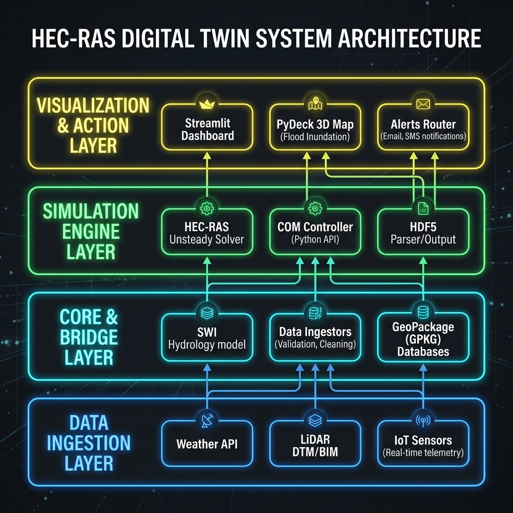
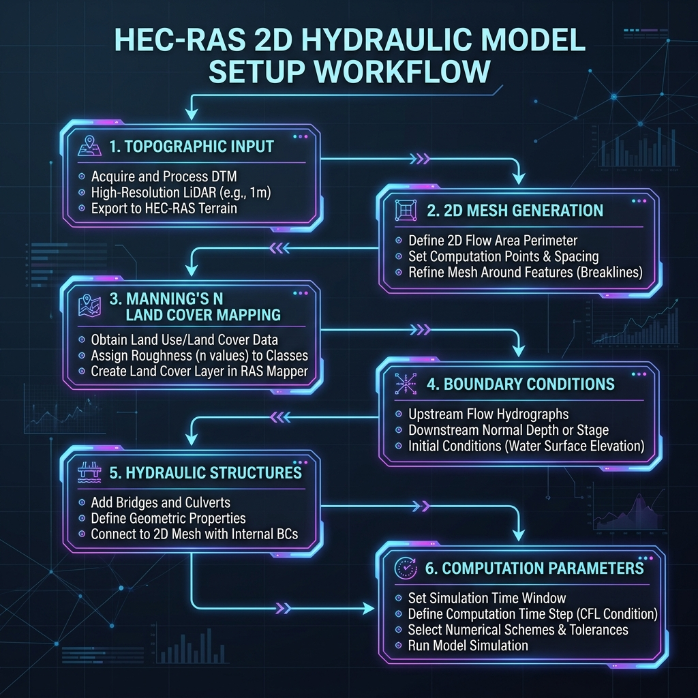
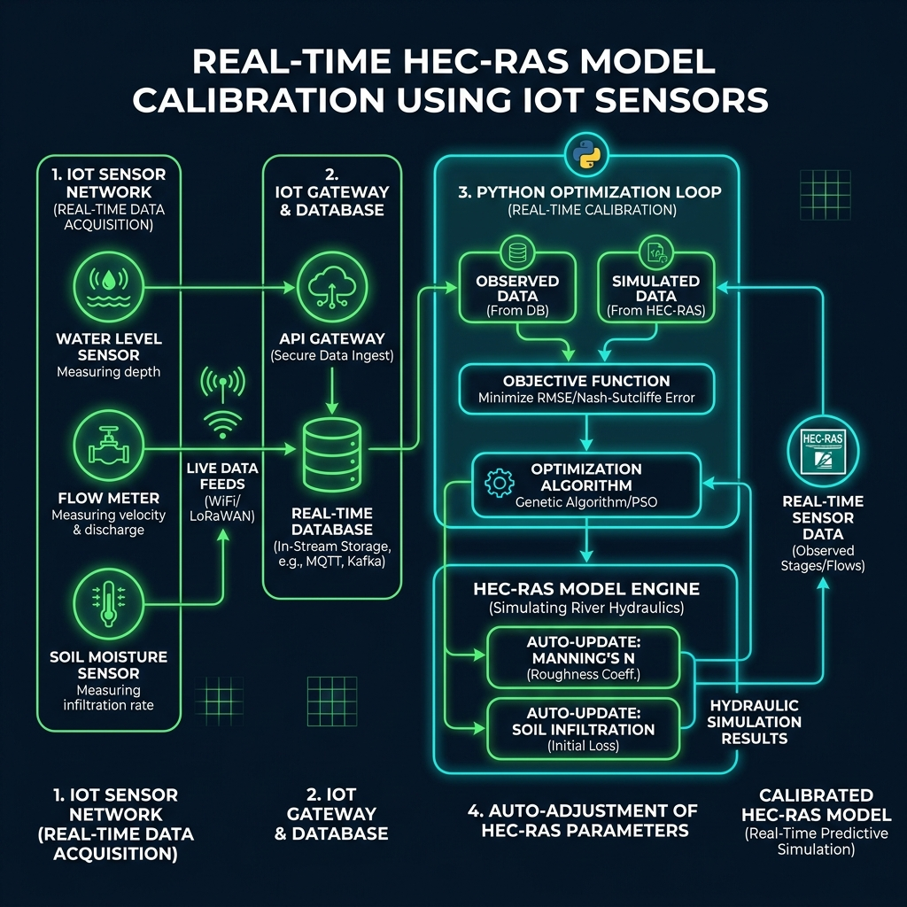

# Blueprints: HEC-RAS Simulation Engine Integration & Implementation

This document provides the architectural integration specs, step-by-step model setup guides, real-time IoT calibration diagrams, and numerical strategies for managing unsteady hydraulic flows within the Railway Flood-Risk Digital Twin.

---

## 1. Digital Twin Architecture & HEC-RAS Integration

The digital twin utilizes a **decoupled 4-layer architecture**. Within this framework, HEC-RAS operates as the core **Layer 3 (Simulation Engine)**. It performs unsteady 2D hydraulic solver calculations without directly managing the asset properties or data routing.



<details>
<summary>Show Mermaid Source Code</summary>

```text
graph TD
    subgraph Layer 1: Data Ingestion
        A1[Open-Meteo Weather API]
        A2[LiDAR DTM / BIM files]
        A3[On-Site IoT Sensors]
    end

    subgraph Layer 2: Core & Bridge
        B1[Rainfall Ingestor]
        B2[SWI Leaky Bucket Hydrology]
        B3[Preprocessors & GPKG Databases]
    end

    subgraph Layer 3: Simulation Engine HEC-RAS
        C1[COM Interface controller]
        C2[HEC-RAS 2D Unsteady Solver]
        C3[HDF5 Plan Result Parser]
    end

    subgraph Layer 4: Visualization & Action
        D1[Streamlit Dashboard]
        D2[PyDeck 2D/3D map render]
        D3[RAMS Alert Router]
    end

    A1 -->|Rainfall Forecast| B1
    A2 -->|GIS Geometries| B3
    A3 -->|Live Feeds| B2
    
    B1 --> B2
    B2 -->|SWI Peak MM| C1
    B3 -->|Centroid & Invert Coordinates| C3
    
    C1 -->|Trigger Simulation run| C2
    C2 -->|Raw cell WSE| C3
    
    C3 -->|Calculated Asset WSE| D3
    D3 -->|Yellow/Orange/Red Warnings| D1
    B3 -->|3D BIM Multipatch| D2
```
</details>

### The In-Simulation Cycle
1. **Triggering**: If the precomputed **Soil Water Index (SWI)** exceeds the configured saturation threshold (e.g. 100 mm), Python triggers the **HECRASBridge** via the Windows COM interface.
2. **Execution**: The HEC-RAS 2D engine runs an unsteady simulation over the grid, taking the incoming forecasted precipitation hydrograph as a boundary condition.
3. **Data Extraction**: The system reads the raw calculation cell results from the generated `*.p01.hdf` binary files and extracts the maximum water surface elevations (WSE) along the track corridor, pushing them to the dashboard database.

---

## 2. HEC-RAS Model Setup for a New Site

When establishing the digital twin for a new railway risk hotspot, follow this systematic setup workflow:



<details>
<summary>Show Mermaid Source Code</summary>

```text
graph TD
    A[Start: New Site Analysis] --> B[1. Import Terrain DTM Raster]
    B --> C[2. Define 2D Computational Mesh]
    C --> D[3. Map Land Cover & Manning's n]
    D --> E[4. Configure Boundary Conditions]
    E --> F[5. Insert Structures culverts, bridges]
    F --> G[6. Configure Solver & Time Steps]
    G --> H{7. Validation & Scour Run}
    H -- Success --> I[Active Deployment]
    H -- Fail --> B
```
</details>

### Actionable Checklist:
1. **Import DTM Terrain**: Load a high-resolution LiDAR DTM (1m resolution is recommended) into HEC-RAS Mapper. This defines the baseline bare-earth topography.
2. **Define 2D Mesh**: Outline the 2D flow area boundary. Use a variable mesh size (e.g., $5\text{ m} \times 5\text{ m}$ cells along the railway track for precision, and larger $20\text{ m} \times 20\text{ m}$ cells in open fields to optimize computation speed).
3. **Map Manning's $n$**: Import a Land Cover shapefile or assign roughness values based on aerial imagery. (Literature standard is $0.015$ for concrete channels, $0.035$ for standard railway ballast, and $0.05$ to $0.08$ for vegetated slopes).
4. **Configure Boundaries**: Establish boundary lines:
   * **Inflow boundaries**: Located at streams, valleys, or drainage inlets upstream.
   * **Outflow boundaries**: Configured at the downstream edges of the 2D area (usually set to *Normal Depth* with the local slope).
5. **Insert Structures**: Place culvert dimensions (circular/rectangular diameters and invert levels) and bridge deck alignments directly into the geometry using BIM blueprints.
6. **Set Time Steps**: Set a stable computation interval. Standard equation is the Courant Condition ($C = V \Delta t / \Delta x \le 1.0$) to avoid numerical instability.

---

## 3. Real-Time HEC-RAS Calibration through IoT Devices

In a fully instrumented corridor, real-time telemetry from on-site IoT sensors can feed an automated calibration feedback loop to continuously tune hydraulic parameters:



<details>
<summary>Show Mermaid Source Code</summary>

```text
sequenceDiagram
    autonumber
    participant IoT as IoT Sensors (Water, Flow, Soil)
    participant DB as Central Database (PostgreSQL)
    participant Cal as Python Calibration Loop
    participant HEC as HEC-RAS Engine (COM)
    
    IoT->>DB: Send real-time readings (water level, velocity, soil moisture)
    Note over Cal: Calibration cycle triggered (e.g., every 6 hours during rain)
    Cal->>DB: Fetch observed water level (H_obs) and soil moisture (M_obs)
    Cal->>HEC: Open HEC-RAS project & run initial simulation
    HEC->>Cal: Return simulated water elevations (H_sim)
    Note over Cal: Compute error: Error = H_obs - H_sim
    alt Error > 10 cm (Roughness mismatch)
        Cal->>Cal: Adjust Manning's n using global optimizer (scipy.optimize)
    else Soil absorption mismatch
        Cal->>Cal: Adjust Soil Infiltration/Loss rates based on soil moisture
    end
    Cal->>HEC: Write updated parameters to geometry (.g01)
    Cal->>HEC: Re-run unsteady simulation & verify error converges < 5 cm
    HEC->>DB: Update database with optimal, calibrated parameters
```
</details>

### The Sensor Integration Strategy:
* **Soil Moisture Probes**: Placed on the embankments (`talus`). They provide the actual soil saturation index, directly overriding the theoretical SWI Leaky Bucket model parameters.
* **Ultrasonic Water Level Sensors**: Installed at culvert inlets and bridge piers. They provide the observed Water Surface Elevation ($H_{obs}$) to calculate the calibration residuals.
* **Acoustic Doppler Velocimeters**: Placed in the stream channels to measure the actual flow velocity ($V_{obs}$), helping calibrate the Manning's roughness coefficient ($n$) independently from depth.

---

## 4. Managing Unstable & Unmanageable Flow Over Time

Unsteady flow computations in HEC-RAS can experience numerical instability or unmanageable volumetric spikes during extreme storms. To maintain model reliability and digital twin uptime, implement the following four controls:

### A. Automatic Adaptive Time-Stepping (Stability Control)
Sudden surges of water dramatically increase local velocity ($V$). Under a fixed computation time-step ($\Delta t$), this spikes the Courant Number ($C$), causing HEC-RAS to exit with a math convergence error (simulations "blowing up").
* **Implementation**: Enable **Adaptive Time-Stepping** in HEC-RAS unsteady computational options. 
* **Mechanism**: Configure HEC-RAS to dynamically cut the time-step in half (e.g. from 1 minute down to 5 seconds) if the Courant number exceeds $1.0$, and restore it when the flow stabilizes.

### B. Downstream Boundary Stabilization (Preventing Artificial Backwater)
If downstream outflow boundaries are poorly configured, water will "pile up" at the edges of the model, reflecting waves back toward the railway corridor and generating fake flood alerts.
* **Implementation**: Use the **Normal Depth** boundary condition and specify a friction slope that matches the local longitudinal slope of the terrain. 
* **Safety Margin**: Extend the 2D mesh boundary at least 500 meters downstream past the last asset of interest. This ensures any boundary turbulence or reflection happens far away from critical assets.

### C. Soil Water Index (SWI) Pre-Alerting
Because a HEC-RAS 2D unsteady run can take 20 to 30 minutes, relying solely on HEC-RAS during a sudden storm creates a dangerous time-lag.
* **Implementation**: The digital twin utilizes the **SWI Hydrological model** as a fast pre-alerting trigger. Because the SWI computes in less than $0.1$ seconds, the system immediately sounds a pre-warning if soil saturation levels spike, even before the HEC-RAS simulation starts calculating.

### D. Dynamic Structural Safety Buffers
Under extreme, unmanageable flows, culverts become pressurized, and normal open-channel formulas fail. 
* **Implementation**: For circular and rectangular culverts, the digital twin alert engine does not rely on a simple water level height comparison. It applies a **Pressurization Buffer**. If the water height is within 10% of the pipe ceiling, it automatically elevates the warning status to **Orange**, anticipating turbulent headwaters and potential structural bypasses.
