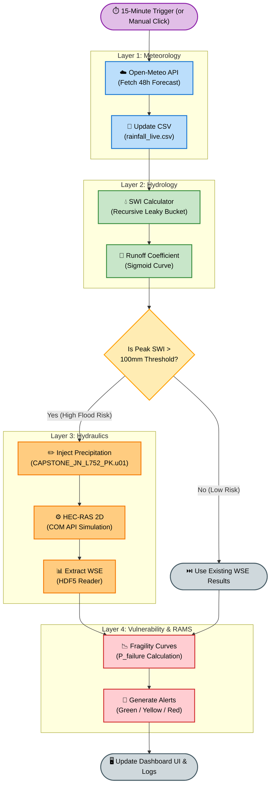
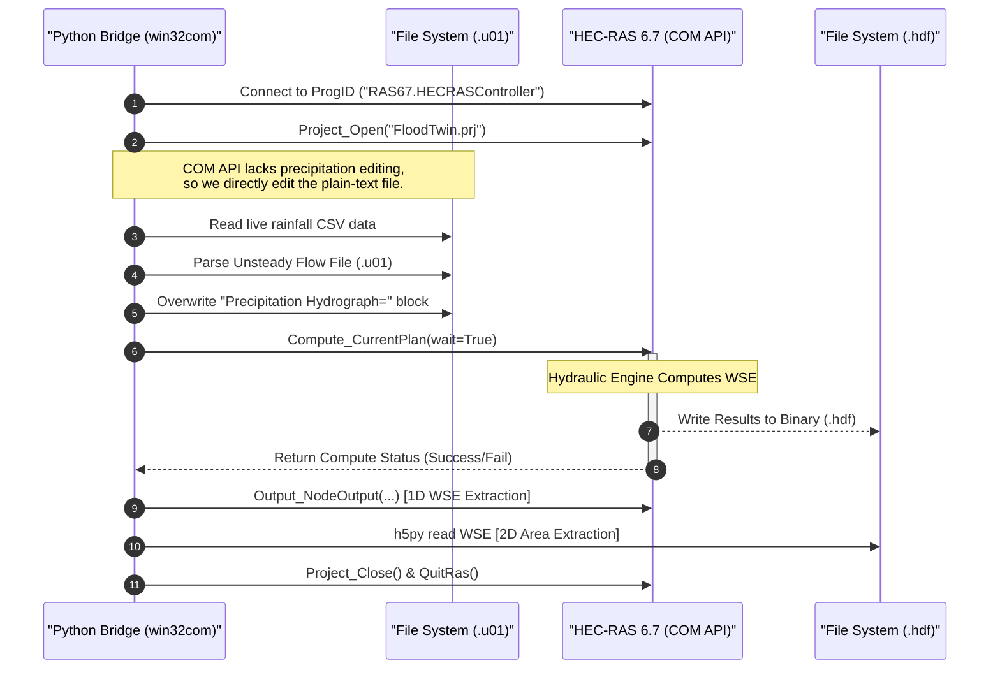

# 15-Minute Operational Re-computation Diagram

This document contains the Mermaid diagram illustrating the automated 15-minute operational cycle. The loop orchestrates the ingestion of live rainfall data, HEC-RAS hydraulic re-computation, asset risk assessment, and system alert updates.

---

## Process Flow Diagram



---

## Detailed Step-by-Step Instructions

### 1. Ingestion Stage (Minutes 0 - 2)
* **Trigger:** A background task runner (such as Windows Task Scheduler or a Python schedule loop) triggers every 15 minutes.
* **Open-Meteo API:** A Python script requests current and forecast rainfall rates using geographical coordinates for the railway corridor.
* **Database Write:** The fetched rainfall values are logged to the database with a timestamp.

### 2. Boundary Condition Prep (Minutes 2 - 3)
* **Flow File Generator:** The pipeline reads the latest rainfall volume and maps it into an unsteady flow input file (`.u01` or similar hydrograph format) accepted by the HEC-RAS model.

### 3. HEC-RAS Execution (Minutes 3 - 10)
* **COM API Control:** The pipeline starts HEC-RAS in background mode via Python's `win32com` library (`hecras_bridge.py`).
* **Compute Loop:** The HEC-RAS hydraulic engine runs the unsteady flow simulation, calculating water surface elevation (WSE) values along the cross sections.

### 4. Post-processing & Extraction (Minutes 10 - 12)
* **HDF5 Parsing:** HEC-RAS writes its outputs to a binary `.hdf` file. The pipeline parses this file using `h5py` to read the calculated profile WSE values at specific cross sections.
* **WSE Storage:** The extracted elevations are saved back into the database.

### 5. Risk Assessment & Alerts (Minutes 12 - 15)
* **Asset Assessment:** The engine calculates clearance metrics by subtracting local WSE values from the physical datum levels of tracks, tunnels, and bridge decks.
* **Alert Triggering:** If clearance falls below safety thresholds, risk levels are marked (e.g., Red/Critical, Yellow/Warning).
* **UI Update:** The Streamlit dashboard live-polls the database, visualising the revised risk ratings and warning banners instantly.

---

## HEC-RAS COM API Integration Detail

This sequence diagram illustrates exactly how the Python bridge interacts with HEC-RAS using the Windows Component Object Model (COM) interface to bypass runtime limitations and extract results.



---

## How to View and Export the Diagram to PDF

Markdown files do not natively render interactive diagrams, but you can view and export this Mermaid flowchart using any of the following methods:

### Method A: VS Code Extensions (Recommended)
1. **View Live:**
   * Open this file (`diagram.md`) in VS Code.
   * Search for and install the extension **Markdown Preview Mermaid Support** (by Matt Bierner).
   * Press `Ctrl + Shift + V` (Windows) to open the Markdown preview pane. The diagram will render dynamically.
2. **Export to PDF:**
   * Install the **Markdown PDF** extension (by yzane) in VS Code.
   * Open `diagram.md` in your editor, right-click, and select **Markdown PDF: Export (pdf)**.
   * *Note: Ensure your Markdown PDF settings have Mermaid support enabled, or use a markdown editor like Typora/Obsidian.*

### Method B: Mermaid Live Editor (Web-based & Cleanest Export)
1. Copy the code block starting with ````mermaid` and ending with ```` from this file.
2. Go to [Mermaid Live Editor](https://mermaid.live).
3. Paste the code into the **Code** section on the left.
4. The diagram will instantly render on the right.
5. Click **Actions** at the bottom of the left/preview pane:
   * Select **Download PNG** or **Download SVG** for high-resolution images.
   * Select **Print / PDF** to save or print the diagram directly to a PDF page.

### Method C: Obsidian or Typora (Desktop Apps)
1. Open this project directory in **Obsidian** or open the file in **Typora**.
2. Both editors support Mermaid natively.
3. Use the app's native export menu: `File` -> `Export` -> `PDF`.
