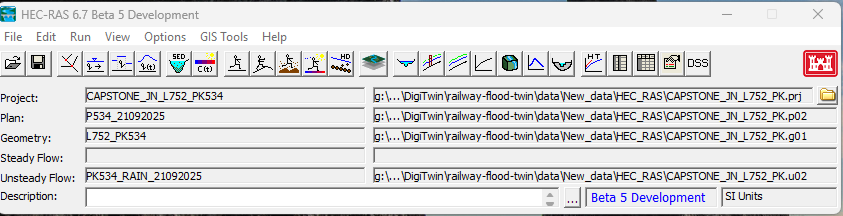

# HEC-RAS Model File Structure & Twin Bridge Integration Guide

This guide explains the HEC-RAS file architecture, how the Python bridge interacts with it, and how unsteady flow data is modified during simulations.

---

## 1. HEC-RAS Model File Structure

A HEC-RAS project consists of multiple plain-text and binary files that work together. All share the same base name (e.g., `CAPSTONE_JN_L752_PK`), but use different extensions to denote their function:

```
CAPSTONE_JN_L752_PK/
├── CAPSTONE_JN_L752_PK.prj        # Project File (Master index)
├── CAPSTONE_JN_L752_PK.g01        # Geometry File (Terrain, Mesh, Structures)
├── CAPSTONE_JN_L752_PK.f01        # Steady Flow File (If used)
├── CAPSTONE_JN_L752_PK.u01        # Unsteady Flow File 1 (Rainfall scenario A)
├── CAPSTONE_JN_L752_PK.u02        # Unsteady Flow File 2 (Rainfall scenario B)
├── CAPSTONE_JN_L752_PK.p01        # Plan File 1 (Binds g01 + u01 + run settings)
├── CAPSTONE_JN_L752_PK.p02        # Plan File 2 (Binds g01 + u02 + run settings)
└── CAPSTONE_JN_L752_PK.p01.hdf    # Output Data File (Binary results for Plan 1)
```

### File Definitions:
* **`.prj` (Project File)**: The entry point. It lists all plans, geometries, and flow files associated with the project.
* **`.gXX` (Geometry File)**: Contains the 1D river lines, 2D flow area meshes, structures, and Manning's roughness coefficients.
* **`.uXX` (Unsteady Flow File)**: Contains flow boundary conditions (hydrographs, stage-flow curves) and **meteorological boundary conditions** (precipitation hydrographs).
* **`.pXX` (Plan File)**: The simulation controller. It binds one Geometry (`.gXX`) and one Flow file (`.uXX`) together, defining the simulation window, computation interval, and processor settings.
* **`.hdf` (Results File)**: Generated after the simulation completes. Contains cell-by-cell water depth, velocity, and elevation values for each time step.

---

## 2. Why the Python Bridge edited `.u01` instead of `.u02`

In your HEC-RAS GUI, you had **Plan 2 (`.p02`)** selected, which uses the flow file **`*.u02`** (`PK534_RAIN_21092025`):



However, the Python bridge modified **`.u01`**. This is because:
1. The default Plan ID configured in the Python engine's run command is **`p01`**.
2. The bridge uses a strict suffix matching rule:
   $$\text{Plan File } (\text{pXX}) \longleftrightarrow \text{Flow File } (\text{uXX})$$
   * For **`p01`**, it modifies **`.u01`**
   * For **`p02`**, it modifies **`.u02`**
3. If you want the Python script to modify and run the `.u02` scenario, you must pass `plan_id="p02"` to the API endpoint or orchestrator function.

---

## 3. How Unsteady Flow is Managed: In-Place Editing vs. Re-creation

### Will the system create a new `.uXX` file for each compute?
**No**, the system does not create new files. Instead, it **edits the existing flow file in-place**.

### Why in-place?
The `.uXX` file contains complex boundary settings, coordinate points, and reference markers (e.g., `Boundary Location=, , , ,PK534_FA_5M2 , , ,PK534_BL , , ,`). Writing these from scratch is highly error-prone and would destroy custom boundary settings created in the HEC-RAS GUI. Overwriting only the `Precipitation Hydrograph` block preserves all other hydraulic boundary details intact.

### How to use the Python Bridge (Example)
Here is how you can programmatically run either Plan 1 (`u01`) or Plan 2 (`u02`):

```python
from src.engine.hecras_bridge import HECRASBridge

# Run Plan 1 (Modifies .u01 and runs .p01)
with HECRASBridge() as bridge:
    bridge.open_project("data/New_data/HEC_RAS/CAPSTONE_JN_L752_PK.prj")
    bridge.recompute_and_extract(
        rainfall_csv_path="data/processed/live_rainfall.csv",
        plan_id="p01"  # Target Plan 1
    )

# Run Plan 2 (Modifies .u02 and runs .p02)
with HECRASBridge() as bridge:
    bridge.open_project("data/New_data/HEC_RAS/CAPSTONE_JN_L752_PK.prj")
    bridge.recompute_and_extract(
        rainfall_csv_path="data/processed/live_rainfall.csv",
        plan_id="p02"  # Target Plan 2
    )
```

---

## 4. Why You Need an Extreme "100 mm Rainfall" Scenario

In civil infrastructure engineering (like SNCF railway standards), simulating an extreme **100 mm convective storm** (where 100 mm of rain falls in exactly 1 hour) acts as the design storm standard.

### Core Reasons for Simulating It:
1. **Infrastructure Stress Testing**: It pushes the drainage systems (ditches, culverts, descentes d'eau) to their absolute capacity limits. This reveals where bottlenecks exist and where water will overflow first.
2. **Operational Safety Boundaries**: By running the worst-case storm, the digital twin maps out the absolute lowest track elevations where water will submerge the rails, establishing safety red-line limits.
3. **Emergency Planning**: It provides a boundary map for emergency services and train dispatchers showing which track segments are vulnerable to rapid washing-out during extreme climate events.

---

## 5. HEC-RAS Plan Files: Use-Case Examples

A **Plan File (`.pXX`)** acts as the configuration cockpit of a HEC-RAS run. It contains:
* **The Suffix Bindings**: Tells the engine which Geometry (`.gXX`) and Flow dataset (`.uXX`) to run together.
* **Timeline settings**: Start/End dates and times.
* **Calculation settings**: Time step size (e.g., 2-second computation intervals) and output frequency.
* **Equations Solver**: Selects either *Diffusion Wave* (fast, approximate) or *Full Momentum* (slow, highly accurate physics).

### Use-Case Examples:

| Use Case | Associated Plan | Suffix Bindings | Solver / Time Settings | Purpose |
| :--- | :--- | :--- | :--- | :--- |
| **A. Stress Testing / Design** | `Plan 1 (.p01)` | Geometry `g01` + Flow `u01` (Synthetic 100mm rain) | **Full Momentum**<br>Computation Step: `1-sec` | To identify maximum hydraulic pressure on culverts and worst-case track overflow zones. |
| **B. Historical Validation** | `Plan 2 (.p02)` | Geometry `g01` + Flow `u02` (Historical storm Sept 2025) | **Full Momentum**<br>Computation Step: `2-sec` | To calibrate the model's roughness parameters by comparing HEC-RAS water levels against actual past marks. |
| **C. Real-time Forecasting** | `Plan 3 (.p03)` | Geometry `g01` + Flow `u03` (48h live Open-Meteo forecast) | **Diffusion Wave**<br>Computation Step: `5-sec` | Optimized for fast runtime in operational systems. Computes in minutes to send live alerts to train dispatchers. |

