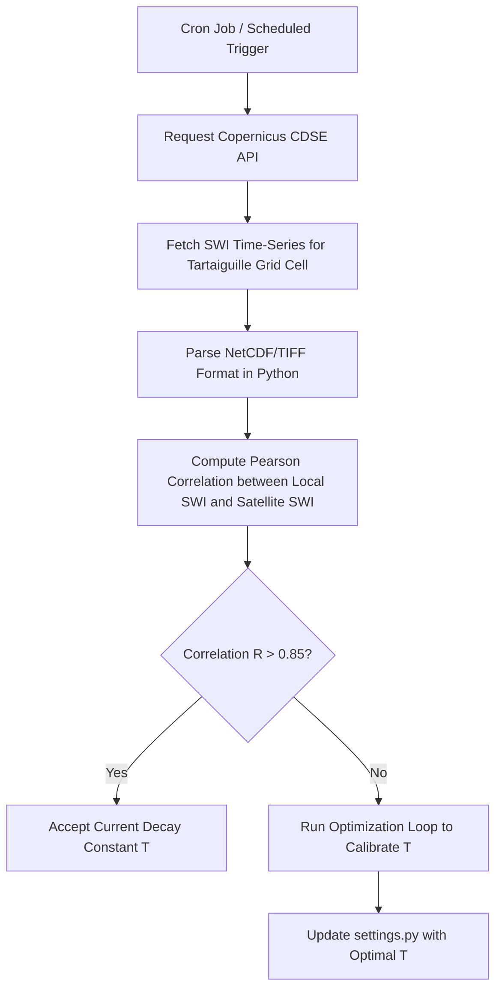
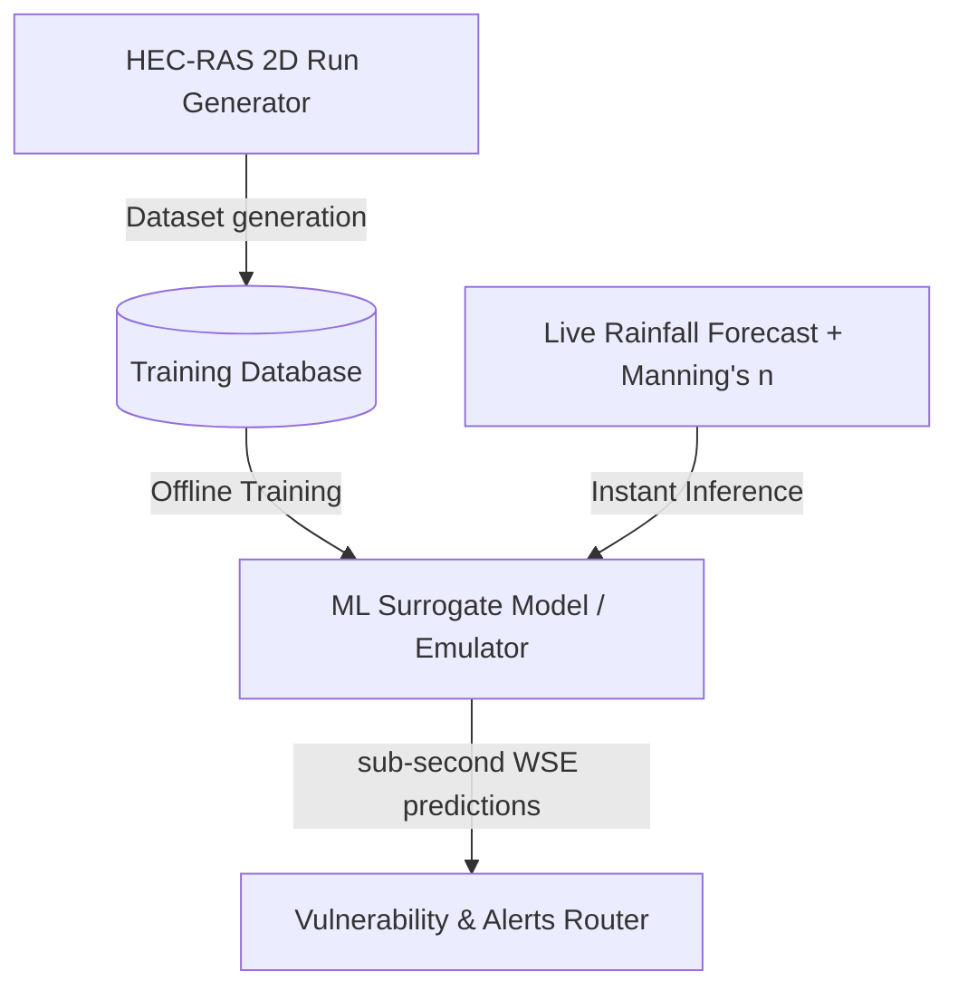
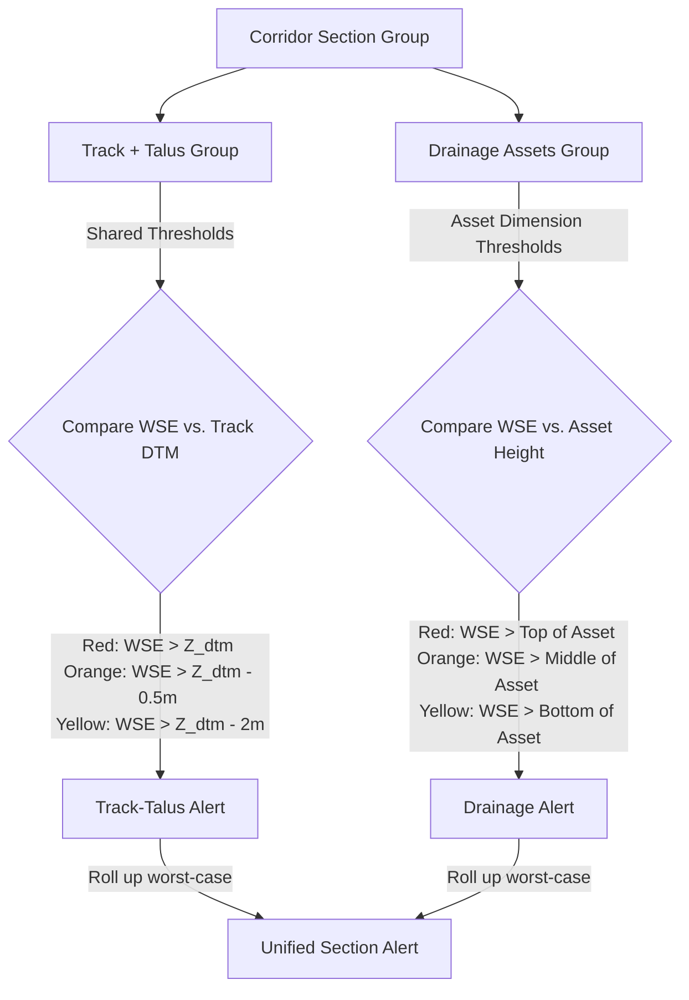
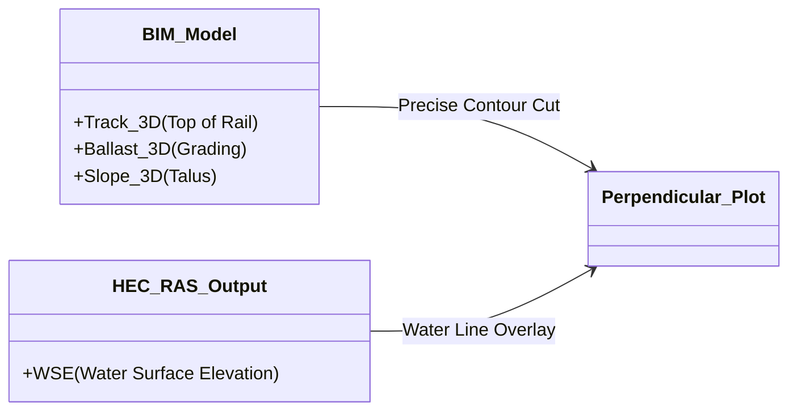
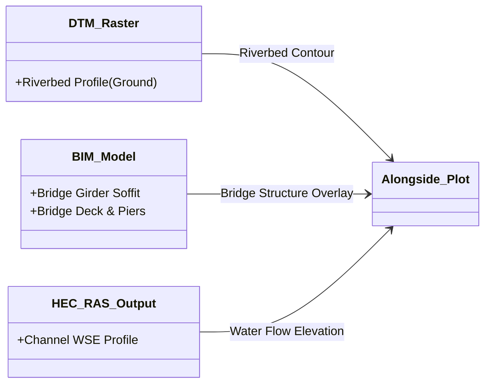
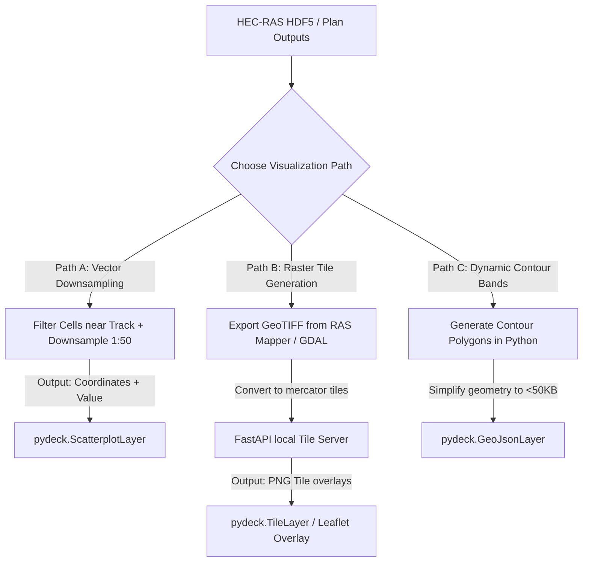
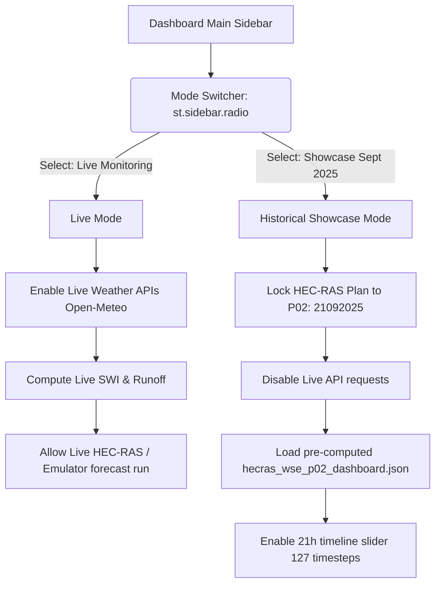

# Future Feature: Satellite Remote Sensing Soil Moisture Comparison

This document outlines the proposed design and step-by-step implementation plan for validating and calibrating the Soil Water Index (SWI) using satellite-derived soil moisture observations.

---

## 1. Objective
Currently, the digital twin validates soil saturation (SWI) using historical **runoff correlation** (comparing rainfall peaks against observed ditch levels). 
For the next phase of the project, we will implement an automated comparison module using satellite data to calibrate the drying decay constant ($T$) dynamically, providing a solid, data-driven validation layer without physical sensors.

---

## 2. Satellite Data Source: Copernicus Sentinel-1 (SWI)
The European Space Agency (ESA) Copernicus Sentinel-1 C-band Synthetic Aperture Radar (SAR) measures surface soil moisture globally at a 1km resolution.
* **Parameter**: Copernicus Soil Water Index (SWI)
* **Access Method**: REST API / Copernicus Data Space Ecosystem (CDSE) or Google Earth Engine (GEE).
* **Update Frequency**: Every 1.5 to 3 days (depending on satellite pass).

---

## 3. Implementation Workflow



### Step 1: Fetch Copernicus Data
Use a python script with the `sentinelhub` library or direct HTTP requests to query the Copernicus CDSE catalog for the grid cell encompassing the coordinates `44.65°N, 4.91°E`.

```python
# Conceptual extraction script
import requests

def fetch_satellite_moisture(lat, lon, start_date, end_date):
    url = "https://catalogue.dataspace.copernicus.eu/apis/wms/v1/swi"
    params = {
        "bbox": f"{lon-0.01},{lat-0.01},{lon+0.01},{lat+0.01}",
        "time": f"{start_date}/{end_date}",
        "format": "application/json"
    }
    response = requests.get(url, params=params)
    return response.json()
```

### Step 2: Correlation Analysis
Compare the satellite soil moisture values against the digital twin's computed SWI values:

$$\rho = \frac{\text{Cov}(SWI_{\text{local}}, SWI_{\text{satellite}})}{\sigma_{\text{local}} \cdot \sigma_{\text{satellite}}}$$

### Step 3: Self-Calibration (Optimization Loop)
If the correlation coefficient is low, run a optimization algorithm (e.g., `scipy.optimize.minimize`) to search for the decay constant $T$ that yields the maximum correlation with satellite observations:

```python
from scipy.optimize import minimize
import numpy as np

def loss_function(T, rainfall_data, satellite_data):
    # Compute local SWI with variable T
    computed_swi = run_swi_model(rainfall_data, T)
    # Compute negative correlation as loss
    correlation = np.corrcoef(computed_swi, satellite_data)[0, 1]
    return -correlation # Minimize negative correlation

# Calibrate
res = minimize(loss_function, x0=[15.0], bounds=[(3.0, 60.0)])
optimal_T = res.x[0]
```

---

## 4. Integration into Digital Twin Dashboard
* **Dashboard Tab**: Add a "Validation Diagnostics" tab.
* **Visualization**: Display a line graph comparing the 30-day history of Satellite SWI against the local calculated SWI, with the current correlation coefficient ($R^2$) displayed in a key metric box.

---

# Future Feature: Machine Learning (ML) Hydraulic Emulator (Surrogate Modeling)

This document outlines the proposed design and step-by-step implementation plan for building a Machine Learning (ML) surrogate model to replace the slow HEC-RAS 2D engine during calibration and live forecasts.

---

## 1. Objective
Currently, running HEC-RAS 2D takes approximately 30 minutes, preventing real-time forecasting and automated parameter calibration. We propose training a fast ML model (surrogate/emulator) that learns the behavior of HEC-RAS 2D and can predict Water Surface Elevation (WSE) along the railway corridor in less than 1 millisecond.

---

## 2. Methodology



### Step 1: Design of Experiments (Data Generation)
Run HEC-RAS 2D offline approximately 50–100 times using a Latin Hypercube Sampling (LHS) design to vary:
* Rainfall intensities (5 mm/h to 120 mm/h)
* Manning's $n$ values (0.025 to 0.080)
Save the simulated WSE results at all 103 railway asset locations to build the training dataset.

### Step 2: Choose and Train the Regressor
Train a machine learning regression model (such as a **Gaussian Process Regressor** or a **Random Forest Regressor**) using Python's `scikit-learn` or `scipy`:

```python
from sklearn.ensemble import RandomForestRegressor
import joblib

# Load dataset: X = [Rainfall_t, Mannings_n], y = [WSE_asset1, WSE_asset2, ...]
X, y = load_hecras_simulation_database()

# Train surrogate model
emulator = RandomForestRegressor(n_estimators=100, random_state=42)
emulator.fit(X, y)

# Save model file
joblib.dump(emulator, "models/hecras_emulator.joblib")
```

### Step 3: Fast Calibration Loop
With the ML emulator running in milliseconds, we can plug it into a standard optimization algorithm to calibrate the physical Manning's $n$ roughness coefficients against surveyed high-water marks:

```python
from scipy.optimize import differential_evolution

# Target observed water levels from mud marks
observed_heights = get_surveyed_high_water_marks()

def calibration_loss(n_values):
    # Predict water levels instantly using the ML emulator
    predicted_heights = emulator.predict([current_rainfall, n_values])
    # Return mean squared error
    return np.mean((predicted_heights - observed_heights) ** 2)

# Run fast global optimizer
result = differential_evolution(calibration_loss, bounds=[(0.02, 0.08)] * num_assets)
calibrated_n_parameters = result.x
```

---

# Future Feature: DTM & Asset Database Sync with New Data

This document outlines the proposed design and synchronization protocol to update the digital twin's spatial database using the latest delivery in `data/New_data/`.

---

## 1. DTM Inconsistencies & Alignment

### The Discovery:
An audit of the DTM file sizes shows a discrepancy between the project's staging DTM and the HEC-RAS model terrain:
* Staging DTM: `data/staging/terrain/dtm_fixed.tif` (1.00 GB / 1,008,225,367 bytes)
* New DTM: `data/New_data/DTM/Terrain.lhd_fx_lasd1.tif` (1.24 GB / 1,246,629,809 bytes)
* HEC-RAS Active Terrain: `data/New_data/HEC_RAS/Terrain/Terrain.lhd_fx_lasd1.tif` (1.24 GB / 1,246,629,809 bytes)

### Conclusion:
The active HEC-RAS 2D model is built using the larger **1.24 GB DTM (`Terrain.lhd_fx_lasd1.tif`)**. The staging DTM is outdated. To prevent horizontal and vertical height displacement errors during safety threshold evaluations, **the staging DTM must be updated to match the active HEC-RAS DTM.**

### Implementation Steps:
1. Replace `data/staging/terrain/dtm_fixed.tif` with a copy of `data/New_data/DTM/Terrain.lhd_fx_lasd1.tif`.
2. Re-run `src/engine/segment_voie.py` and `src/engine/extract_cross_sections.py` to re-extract the exact track centerline elevations and asset profiles from the new DTM mesh.

---

## 2. Asset Layer Synchronization Plan

### Objective:
Verify whether the raw shapefiles in `data/New_data/INFRA_SNCF/OBJECTS_OH/2d/` have updates or new features that are not captured in the cleaned `data/staging/gis/*.gpkg` databases.

### Audit Findings (Feature Count Comparison):
We ran a Python GIS audit script comparing the feature counts between your active staging databases and the raw shapefiles in the `New_data` folder.

| Asset Layer | Staging File (.gpkg) | Staging Count | New Shapefile (.shp) | New Count | Status / Discrepancy |
| :--- | :--- | :---: | :--- | :---: | :--- |
| **Track** | `voie_fixed.gpkg` | 1 | `Railway_Track.shp` | 1 | Synchronized |
| **Bridges** | `Pont Rail_fixed.gpkg` | 4 | `Railway_bridge.shp` | 4 | Synchronized |
| **Descent Channels** | `Descente d'eau_fixed.gpkg` | 3 | `Drainage_chute.shp` | 3 | Synchronized |
| **BIM Earthworks** | `Talus Terre_fixed.gpkg` | 38 | `Earthworks.shp` | 38 | Synchronized |
| **Concrete Ditches** | `Fossé terre revêtu_fixed.gpkg` | 22 | `Drainage_ditch_concrete_lined.shp` | 22 | Synchronized |
| **Earthen Ditches** | `Fossé terre_fixed.gpkg` | **31** | `Unlined_drainage_ditch.shp` | **41** | ⚠️ **10 Missing Features in Staging** |
| **Circular Culverts** | `Buse_fixed.gpkg` | 7 | `Circular_culvert.shp` | 7 | Synchronized |
| **Rectangular Culverts** | `Dalot_fixed.gpkg` | 1 | `Rectangular_culvert.shp` | 1 | Synchronized |
| **Road Overlays** | `routes_fixed.gpkg` | 2 | `Roads.shp` | 2 | Synchronized |
| **Third Party Structures** | `reseau tiers-fixed.gpkg` | 1 | `Third_party_structure.shp` | 1 | Synchronized |

### Conclusion & Plan of Action:
While most layers are perfectly synchronized, **the Earthen Ditches (`Fossé terre`) layer has a 10-feature discrepancy** (31 in staging vs 41 in `New_data`). 

To update this, you should execute this conversion script:

```python
import geopandas as gpd
from pathlib import Path

# Load raw shapefile
raw_path = Path("data/New_data/INFRA_SNCF/OBJECTS_OH/2d/Unlined_Drainage_Ditch/Unlined_drainage_ditch.shp")
df_raw = gpd.read_file(raw_path)

# Ensure EPSG:2154
if df_raw.crs != "EPSG:2154":
    df_raw = df_raw.to_crs("EPSG:2154")

# Export to staging replacing the old file
output_path = Path("data/staging/gis/Fossé terre_fixed.gpkg")
df_raw.to_file(output_path, layer="foss_terre", driver="GPKG")
print("Successfully updated Fossé terre_fixed.gpkg to 41 features!")
```
After updating the geopackages and the DTM file, remember to run `src/engine/segment_voie.py` to rebuild `z_config.json` and ensure all 10 new ditch assets get their Z-elevation thresholds calculated.

---

## 3. 3D BIM Model Sync (Replacing `maquette_3d`)

### The Discovery & Audit:
We detected that the `data/New_data` delivery contains duplicate 3D and 2D asset datasets across multiple directories:
1. **3D Directories**:
   - `data/New_data/CAPSTONE/3D_OBJECTS/LN5_GC_752000_534_536/3d/`
   - `data/New_data/INFRA_SNCF/OBJECTS_OH/3d/`
2. **2D Directories**:
   - `data/New_data/CAPSTONE/2D_OBJECTS/LN5_GC_752000_534_536/2d/`
   - `data/New_data/INFRA_SNCF/OBJECTS_OH/2d/`

To verify the integrity and exact differences between these duplicated folders, we performed a bitwise comparison and binary record audit:

#### 3D Data Comparison Results:
* **Identical Files**: 32 out of 35 files are byte-for-byte identical between CAPSTONE and INFRA_SNCF directories (representing track, tunnels, ditches, roads, etc.).
* **Mismatch Found**: The files for `Circular_culvert_3D` (`.shp`, `.shx`, `.dbf`) differ between the two deliveries:
  * **INFRA_SNCF version**: `.shp` is **43,976 bytes**, last modified **June 2026** (Record Count = 7).
  * **CAPSTONE version**: `.shp` is **39,104 bytes**, last modified **December 2025** (Record Count = 7).
  * **Conclusion**: Both contain exactly 7 features, but the INFRA_SNCF shapefile is larger and has a newer modification date, indicating it has more detailed geometry or attributes.

#### 2D Data Comparison Results:
* All core geometry files (`.shp`, `.shx`, `.dbf`) are identical.
* **CAPSTONE version** includes spatial projection files (`.prj`) for several layers:
  * `Circular_culvert.prj`, `Drainage_chute.prj`, `Drainage_ditch_concrete_lined.prj`, `Earthworks.prj`, `Railway_bridge.prj`, `Rectangular_culvert.prj`, `Third_party_structure.prj`.
  * **INFRA_SNCF version** lacks these `.prj` files.
  * **Conclusion**: The CAPSTONE 2D files are more complete for direct GIS consumption because they contain critical projection metadata.

### Action Taken:
To prepare for upgrading your 3D assets, we copied the contents of the newer, more detailed **`data/New_data/INFRA_SNCF/OBJECTS_OH/3d/`** to a new pending staging folder:
* **Staging Folder**: [maquette_3d_new_pending](file:///c:/Users/ktstr/Documents/railway-flood-twin/data/raw/maquette_3d_new_pending/)
* The original data inside `data/New_data/` has been left completely intact (not moved).

### Naming Mapping Sheet:
When you are ready to replace `data/raw/maquette_3d/` with these new files, rename/map the directories inside `data/raw/maquette_3d_new_pending/` according to the following sheet to match your project conventions:

| New Folder Name (in `maquette_3d_new_pending`) | Old Folder Name (in `maquette_3d`) | Description / Mapping Action |
| :--- | :--- | :--- |
| `Railway_track_3D` | `voie` | Rename folder to `voie` |
| `Tunnel_3D` | `tunnel` | Rename folder to `tunnel` |
| `Recatangular_culvert_3D` | `dalot` | Rename folder to `dalot` |
| `Circular_culvert_3D` | `base` | **Note**: The old `maquette_3d/base` folder holds `Circular_culvert_3D.*`. Place files inside a folder named `base`. |
| `Drainage_ditch_concrete_lined_3D` | `fosse_terre_revetu` | Rename folder to `fosse_terre_revetu` |
| `Unlined_drainage_ditch_3D` | `fosse_terre` | Rename folder to `fosse_terre` |
| `Drainage_chute_3D` | `Descente_eau` | Rename folder to `Descente_eau` |
| `Earthworks_3D` | `talus_terre` | Rename folder to `talus_terre` |
| `Roads_3D` | `routes` | Rename folder to `routes` |

> [!NOTE]
> The old `maquette_3d` directory contains a folder `drainage_longitudinal_ciel_ouvert` (representing unlined earth ditches) which does not appear in the new 3D delivery. The new delivery instead uses `Unlined_drainage_ditch_3D` (corresponding to the old `fosse_terre` folder). Make sure to preserve any extra directories like `drainage_longitudinal_ciel_ouvert` if you want to keep them!

### How to Replace:
1. Back up your old `data/raw/maquette_3d/` directory (e.g., compress it to a `.zip` or copy to `maquette_3d_backup/`).
2. Rename the folders in `data/raw/maquette_3d_new_pending/` using the mapping sheet above.
3. Replace/overwrite the folders in `data/raw/maquette_3d/` with these renamed folders.
4. Re-run your BIM ingestion scripts (e.g., `scratch/ingest_bim_assets.py` or the configured pipeline tool) to load the new 3D geometries.


---

# Future Feature: Group-Based Asset & Alert Management (Unified Track-Talus Sections)

## 1. The Core Limitation: Spatial Proximity vs. Physical Connection
Currently, the digital twin maps relationships between assets (such as connecting a culvert `Buse_0` or slope `Talus Terre_12` to a track segment `Voie_seg_11`) by finding the **nearest spatial neighbor** in 2D coordinates.

However, simple 2D spatial distance is a fragile indicator:
* **No Functional Connection**: An asset might be physically closer to track segment $A$ but functionally engineered to support or drain track segment $B$.
* **False Alarms & Misaligned Thresholds**: An alarm on a culvert could be routed to the wrong track segment, shutting down a section of track that is not actually in danger, or missing a real threat to the structurally dependent track.

## 2. Proposed Architecture: Unified Structural & Drainage Groups
To resolve this, we propose migrating the database design from a flat spatial-proximity check to a **directly connected physical grouping** system:



### Key Design Principles:
1. **Track + Talus Group (Shared Thresholds)**:
   Since the track is physically supported by the slope (talus), they are combined into a single group sharing the same thresholds, calculated directly from the track segment DTM centerline elevation ($Z_{\text{DTM}}$):
   * **🔴 Red (`red_z_m`) = $Z_{\text{DTM}}$** (Water submerges the track/top of rail)
   * **🟠 Orange (`orange_z_m`) = $Z_{\text{DTM}} - 0.5\text{ m}$** (Water reaches the base of the ballast / soaks the embankment slope)
   * **🟡 Yellow (`yellow_z_m`) = $Z_{\text{DTM}} - 2.0\text{ m}$** (Water reaches the foot of the slope/side drainage capacity)
2. **Drainage Assets Group (Physical Dimension Thresholds)**:
   Ditches and culverts are grouped separately and have thresholds defined independently by their physical size and flow-line levels:
   * **🔴 Red (`red_z_m`) = WSE rises above the top of the asset** (Opening is fully submerged; pipe/channel runs under full pressure flow or overflows)
   * **🟠 Orange (`orange_z_m`) = WSE rises above the middle of the asset** (Flow reaches $>50\%$ of the asset's vertical height)
   * **🟡 Yellow (`yellow_z_m`) = WSE rises above the bottom of the asset** (Water first enters the pipe/channel invert or bottom flow-line)
3. **Group-Level Alert Management**:
   The dashboard and warnings router consolidate alerts at the combined section group level. The system checks the status of both the **Track-Talus Group** and the **Drainage Group**, then rolls up the worst-case warning to dispatchers.

## 3. Database Schema Implementation
The updated `z_config.json` schema will transition to this grouped format:

```json
{
  "Group_Section_11": {
    "group_id": "Section_11",
    "track_talus": {
      "track_id": "Voie_seg_11",
      "talus_id": "Talus Terre_12",
      "z_dtm_m": 209.91,
      "yellow_z_m": 207.91,
      "orange_z_m": 209.41,
      "red_z_m": 209.91
    },
    "drainage_assets": [
      {
        "id": "Buse_0",
        "type": "Circular Culvert",
        "invert_bottom_m": 203.61,
        "height_m": 1.0,
        "yellow_z_m": 203.61,
        "orange_z_m": 204.11,
        "red_z_m": 204.61
      }
    ]
  }
}
```

---

## 4. Visualizing Cross-Sections (Perpendicular vs. Alongside Profiles)

To provide clear diagnostics on the dashboard, the digital twin will render cross-section profiles showing the water level relative to the assets. We will use two distinct visualization profiles:

````carousel
### Profile 1: Perpendicular (Standard Sections)
* **Applied to**: 17 Embankment Groups (e.g., `Voie_seg_11` + `Talus Terre_12`)
* **View**: A cross-section cut **perpendicular** (orthogonal) to the track centerline.
* **Data Sources**: **BIM Data only** (replacing DTM).
* **Rationale**: Raw DTM rasters are too coarse (1m resolution) to capture details like track rails, ballast grading, and exact ditch channels. The perpendicular view cuts through the high-precision 3D BIM models to display sharp, accurate contours of the rails, ballast, and slope, overlaying the simulated HEC-RAS water level.



<!-- slide -->
### Profile 2: Alongside/Longitudinal (Bridge Sections)
* **Applied to**: 4 Bridge Groups:
  - `Voie_seg_02` (Pont Rail_1)
  - `Voie_seg_08` (Pont Rail_0)
  - `Voie_seg_11` (Pont Rail_3)
  - `Voie_seg_19` (Pont Rail_2)
* **View**: A profile cut **alongside** (parallel to) the waterway channel flowing under the bridge.
* **Data Sources**: **Combined BIM + DTM**.
  - **BIM**: Provides exact elevations of the bridge deck, piers, and girder soffit.
  - **DTM**: Provides the continuous ground profile of the riverbed/waterway channel below the bridge.
* **Rationale**: This alongside view allows users to see the water flowing through the channel under the bridge structure, directly illustrating the remaining clearance (soffit height) between the water surface and the bridge girders.


````
 


---

# Future Feature: Accumulated Rainfall Graph

This document outlines the proposed design and implementation plan for adding an Accumulated Rainfall visualization to the digital twin dashboard.

---

## 1. Objective
While hourly rainfall intensity is crucial for identifying flash flood peaks, the **total volume of water** delivered over a storm duration determines the catchment-scale soil saturation (SWI) and the prolonged height of water in ditches. 
Adding an accumulated rainfall graph allows operators to see the running total of rainfall (in mm) over the monitoring/forecast window, providing context for how much total water the watershed has received.

---

## 2. Mathematical Definition
Given a rainfall intensity time series $P(t)$ in $\text{mm/h}$ sampled at uniform intervals $\Delta t$ (in hours):

$$P_{\text{acc}}(t) = \sum_{i=1}^{t} P(i) \cdot \Delta t$$

* For hourly data (e.g., Open-Meteo): $\Delta t = 1.0\text{ hour}$, so $P_{\text{acc}}(t) = \sum P(i)$
* For 5-minute data (e.g., HEC-RAS flow boundaries): $\Delta t = \frac{5}{60}\text{ hours} \approx 0.0833\text{ hours}$

---

## 3. Implementation Workflow

### Step 1: Compute Cumulative Sum
In Python (e.g., in `src/dashboard/app_main.py` or `src/engine/swi_calculator.py`), we compute the rolling sum of rainfall:

```python
import pandas as pd

def calculate_accumulated_rainfall(df: pd.DataFrame, interval_minutes: float = 60.0) -> pd.DataFrame:
    """
    Computes accumulated rainfall in mm from rainfall intensities (mm/h).
    """
    df = df.copy()
    dt_hours = interval_minutes / 60.0
    # intensity_mm_h * dt_hours gives the depth (mm) for that timestep
    df['step_depth_mm'] = df['intensity_mm_h'] * dt_hours
    df['accumulated_rainfall_mm'] = df['step_depth_mm'].cumsum()
    return df
```

### Step 2: Create a Dual-Axis Visualization
To display both the instantaneous rain rate and the cumulative total without cluttering the screen, implement a dual-axis chart using `plotly.graph_objects`:

```python
import plotly.graph_objects as go
from plotly.subplots import make_subplots

def plot_rainfall_diagnostics(df: pd.DataFrame):
    # Create figure with secondary y-axis
    fig = make_subplots(specs=[[{"secondary_y": True}]])

    # Add bars for hourly/step intensity
    fig.add_trace(
        go.Bar(
            x=df['timestamp'],
            y=df['intensity_mm_h'],
            name="Intensity (mm/h)",
            marker_color="rgba(41, 128, 185, 0.6)", # Sleek blue
        ),
        secondary_y=False,
    )

    # Add line for cumulative/accumulated rainfall
    fig.add_trace(
        go.Scatter(
            x=df['timestamp'],
            y=df['accumulated_rainfall_mm'],
            name="Accumulated (mm)",
            mode="lines",
            line=dict(color="#d35400", width=3), # Sleek orange/red
        ),
        secondary_y=True,
    )

    # Set axis titles
    fig.update_xaxes(title_text="Time")
    fig.update_yaxes(title_text="Intensity (mm/h)", secondary_y=False)
    fig.update_yaxes(title_text="Accumulated Rainfall (mm)", secondary_y=True)

    fig.update_layout(
        title_text="Rainfall Profile & Accumulation",
        hovermode="x unified",
        legend=dict(orientation="h", yanchor="bottom", y=1.02, xanchor="right", x=1)
    )
    return fig
```

---

## 4. UI/UX Dashboard Integration
* **Key Metric Box**: Add a large value metric displaying the **"Total Expected Storm Rainfall (mm)"** at the top of the tab so users can immediately evaluate storm severity.


---

# Future Feature: HEC-RAS 2D Flow Mapping Overlay (WSE, Depth, Velocity)

This document outlines the proposed design and step-by-step implementation options for visualizing 2D hydraulic results (such as WSE, depth, and velocity) directly on the dashboard's interactive map, matching the rendering style of HEC-RAS Mapper.

---

## 1. The Challenge: Browser Memory vs. 950K Grid Cells
The HEC-RAS 2D computational mesh for the Tartaiguille corridor contains **950,122 cells**. 
* Attempting to render 1 million cell polygons as vector data (GeoJSON) in a browser using Folium or PyDeck will exceed WebGL/memory limits, resulting in severe lag or a browser crash.
* To display spatial hydraulic variables (WSE, Depth, Velocity) smoothly, we must use optimized downsampling or rasterization strategies.

---

## 2. Implementation Strategies



### Option A: Downsampled Point Cloud (Vector Scatterplot)
Instead of drawing cell polygons, read the cell centers and results, downsample the grid (e.g. taking 1 in every 50 cells, or filtering only cells within a 150-meter buffer of the track), and render them as colored points.

* **Python Downsampling Logic**:
```python
import pandas as pd
import numpy as np

def extract_downsampled_flow_data(reader, timestep_idx, max_points=10000):
    # Get coordinates and min elevations
    centers = reader.cell_centers # (N_cells, 2) - Lambert 93
    min_elev = reader.cell_min_elevation # (N_cells,)
    
    # Get Water Surface Elevation (WSE)
    wse = reader.get_wse(timestep_idx) # (N_cells,)
    
    # Calculate depth
    depth = np.maximum(0.0, wse - min_elev)
    
    # Filter active wet cells (depth > 0.05m)
    wet_indices = np.where(depth > 0.05)[0]
    
    # Downsample
    if len(wet_indices) > max_points:
        step = len(wet_indices) // max_points
        selected_indices = wet_indices[::step]
    else:
        selected_indices = wet_indices
        
    # Convert Lambert 93 center coordinates to WGS84 (lat/lon)
    # (Using projection library, e.g., pyproj)
    lats, lons = convert_coordinates_l93_to_wgs84(
        centers[selected_indices, 0], 
        centers[selected_indices, 1]
    )
    
    return pd.DataFrame({
        "lat": lats,
        "lon": lons,
        "wse": wse[selected_indices],
        "depth": depth[selected_indices],
        # Add velocity if reading Face Velocity or cell velocity
    })
```

* **PyDeck Visualizer Layer**:
```python
import pydeck as pdk

# Color scale mapping depth (0 to 3m) to Color (Light Blue to Dark Blue)
depth_layer = pdk.Layer(
    "ScatterplotLayer",
    data=df_wet_downsampled,
    get_position=["lon", "lat"],
    get_radius=15, # Metres
    radius_units="meters",
    get_fill_color="[41, 128, 185, depth * 80]", # Alpha scales with depth
    pickable=True,
)
```

---

### Option B: Raster Map Tiles (Smooth GIS Overlay — Recommended)
This is the standard professional method for GIS web applications. HEC-RAS Mapper exports the depth/velocity results as a raster stack (GeoTIFF) per time step. We convert the raster into a tiled folder structure and overlay it on the map.

1. **Raster Export**: In RAS Mapper, right-click the plan results and select **Export Raster** (choose Depth or Velocity) for the desired time steps.
2. **Reprojection and Tiling**: Use GDAL command-line tools to convert the GeoTIFFs to Web Mercator (`EPSG:3857`) and generate a tile pyramid:
   ```bash
   gdal2tiles.py --zoom=12-16 --xyz --processes=4 depth_map.tif ./tiles/depth/
   ```
3. **Serving Tiles**: Configure FastAPI to serve the generated PNG files:
   ```python
   from fastapi.staticfiles import StaticFiles
   app.mount("/static/tiles", StaticFiles(directory="data/processed/tiles"), name="tiles")
   ```
4. **PyDeck Rendering**:
   ```python
   # Display the dynamic depth tile overlay on the map
   tile_layer = pdk.Layer(
       "TileLayer",
       data=f"http://localhost:8000/static/tiles/depth/t_{timestep_idx}/{{z}}/{{x}}/{{y}}.png",
       pickable=False,
   )
   ```
   * *Benefit*: This allows showing the smooth high-resolution color gradients representing depth or velocity exactly as they look in HEC-RAS Mapper, with 0% browser lag.

---

### Option C: Simplified Vector Contours
Use `matplotlib.contour` or GIS contour operations (in `GDAL/OGR`) to group cells into discrete depth zones (e.g., `0.0–0.5m`, `0.5–1.5m`, `1.5m+`), convert those contours to simplified GeoJSON polygon vectors, and color each polygon based on its zone.

* **Dashboard Integration**:
```python
# Legend / Layer Selector in Dashboard Sidebar
visualization_variable = st.sidebar.selectbox(
    "Map Flow Variable", 
    ["Asset Risk Alerts Only", "Flood Inundation Boundary", "Water Depth Heatmap", "Velocity Fields"]
)
```


---

# Future Feature: Dual-Mode Dashboard (Live Mode & Historical Showcase Mode)

This document outlines the proposed design to restructure the digital twin user interface into two distinct operating modes: a live forecaster and a historical demonstration showcase.

---

## 1. Objective
To make the digital twin suitable for both real-time operational safety monitoring and interactive stakeholder presentations, the dashboard will support two clear modes:
1. **Live Mode**: Continuously pulls current rainfall forecasts, updates the SWI, and allows running live forecast simulations.
2. **Showcase Mode (Historical Cevenol Storm - Sept 21, 2025)**: Replays the real-world September 2025 extreme flood event using pre-computed HEC-RAS Plan 2 (`21092025`) results. This serves as the primary showcase to verify asset risk thresholds and demonstrate the twin's capabilities.

---

## 2. Interface and Logic Architecture



### Step 1: Sidebar Mode Selection
Simplify the dashboard sidebar options to present these two modes clearly:

```python
# src/dashboard/app_main.py
import streamlit as st

st.sidebar.title("Operational Mode")
app_mode = st.sidebar.radio(
    "Select Mode",
    options=["Live Monitoring", "Historical Showcase (Sept 2025)"],
    help="Switch between real-time weather monitoring and the historical Cevenol storm showcase."
)
```

### Step 2: Route Flow Data and Plan Configuration
Depending on the chosen mode, configure the input rainfall data and the HEC-RAS plan:

```python
# src/dashboard/app_main.py

if app_mode == "Historical Showcase (Sept 2025)":
    st.sidebar.info("Showcasing the extreme September 2025 Cevenol flood event (Plan 2).")
    
    # Force the HEC-RAS plan to Plan 2 (Historical)
    selected_plan = "P02: 21SEP2025 (Historical event, 21h)"
    is_real_hecras = True
    
    # Load pre-computed historical results (127 steps)
    wse_results = load_wse_results("P02: 21SEP2025 (Historical event, 21h)")
    
    # Display historical rainfall parameters
    current_rain = 0.0 # Loaded from historical timeseries per timestep
    
else: # Live Monitoring Mode
    st.sidebar.success("Monitoring live meteorological updates.")
    
    # Toggle live configuration
    selected_plan = st.sidebar.selectbox(
        "Simulation Forecast Target",
        ["Live Forecast (HEC-RAS / Emulator)", "synthetic"],
        help="Select 'synthetic' for 48h scenario testing, or 'Live' to run the actual forecast."
    )
    
    # Fetch live Open-Meteo rainfall
    wse_results = load_wse_results(selected_plan)
```

---

## 3. Timeline Slider Adjustments
* **Live Mode**: The time slider handles the standard **48-hour forecast window** (hourly steps).
* **Showcase Mode**: The time slider adjusts to the **21-hour duration of the September 2025 event**, mapped to the **127 computation steps** (5-minute output intervals) in the HEC-RAS HDF5 file. This allows users to scrub slowly through the peak of the historical storm and watch how water overflows specific ditches and culverts in high temporal detail.

---

## 4. Play Button — Automatic Timeline Animation

To demonstrate the flood evolution without manual slider interaction, the dashboard will include a **Play / Pause** button that automatically advances the timeline from the first timestep to the last, updating the map, charts, and alert status in real-time.

### Behavior:
* **Play (▶)**: Starts auto-advancing the timeline slider at a configurable speed (e.g., 1 step every 500ms).
* **Pause (⏸)**: Freezes the animation at the current timestep, allowing the user to inspect alerts and charts.
* **Speed Control**: A sidebar slider to adjust animation speed (e.g., "Fast" = 200ms/step, "Normal" = 500ms/step, "Slow" = 1000ms/step).
* **Loop Option**: A checkbox to loop the animation continuously for kiosk/demo displays.

### Implementation Concept (Streamlit):

```python
import streamlit as st
import time

# --- Animation Controls ---
col_play, col_speed = st.columns([1, 2])
with col_play:
    is_playing = st.toggle("▶ Play Animation", value=False, key="play_toggle")
with col_speed:
    animation_speed_ms = st.slider(
        "Speed (ms/step)", min_value=100, max_value=2000, value=500, step=100
    )

# --- Timeline Slider ---
max_steps = len(wse_results.get("timestamps", [])) or 48
t_idx = st.slider("Timeline", 0, max_steps - 1, 0, key="timeline_slider")

# --- Auto-advance logic ---
if is_playing:
    # Streamlit reruns on each state change, so we advance one step per rerun
    if t_idx < max_steps - 1:
        time.sleep(animation_speed_ms / 1000.0)
        st.session_state["timeline_slider"] = t_idx + 1
        st.rerun()
    else:
        # Reached the end
        if st.session_state.get("loop_animation", False):
            st.session_state["timeline_slider"] = 0
            st.rerun()
        else:
            st.session_state["play_toggle"] = False
            st.rerun()
```

### Visual Behavior During Playback:
* The **map** updates flood polygons / depth overlays per timestep.
* The **WSE chart** highlights the current timestep marker moving along the time axis.
* The **alert table** dynamically updates showing which assets enter Yellow → Orange → Red as water rises.
* The **rainfall bar chart** highlights the current hour's intensity bar.

