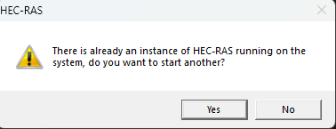
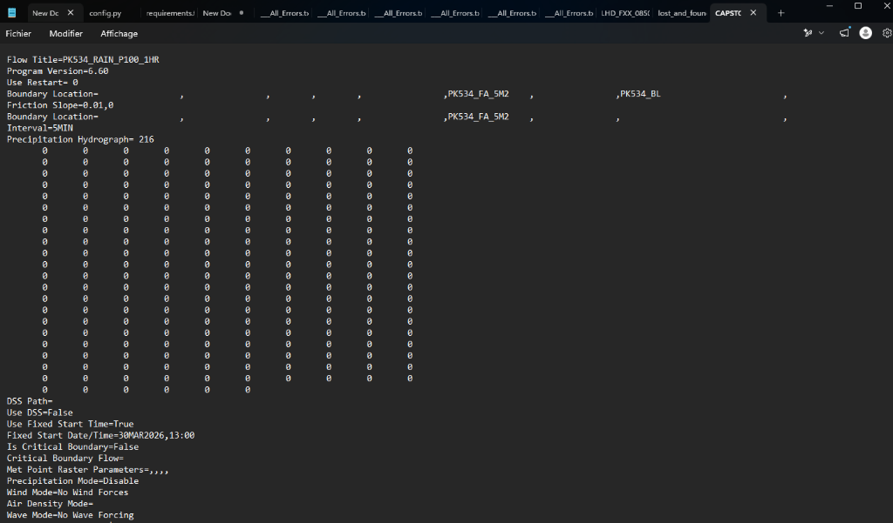
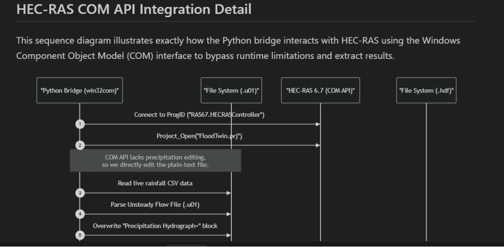
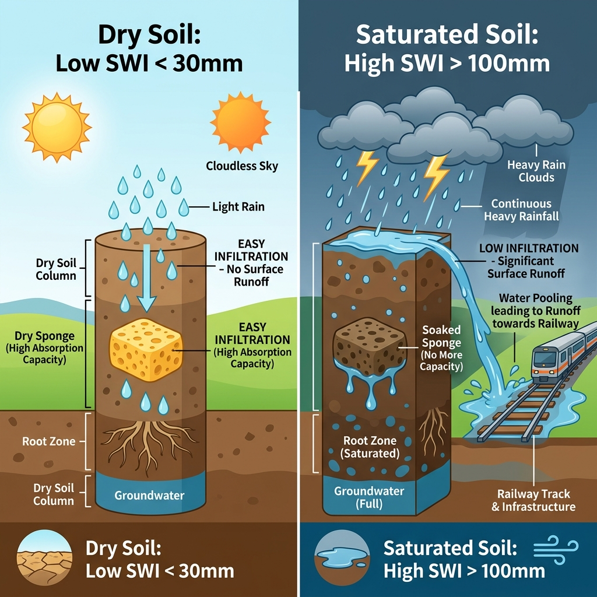
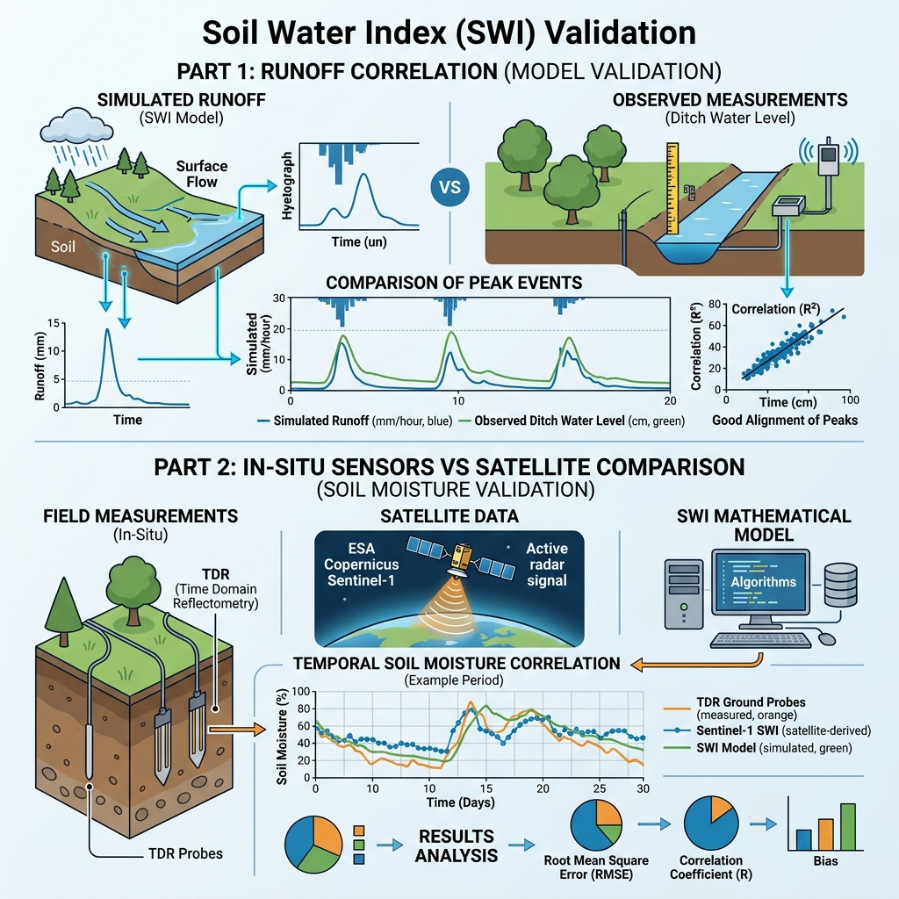
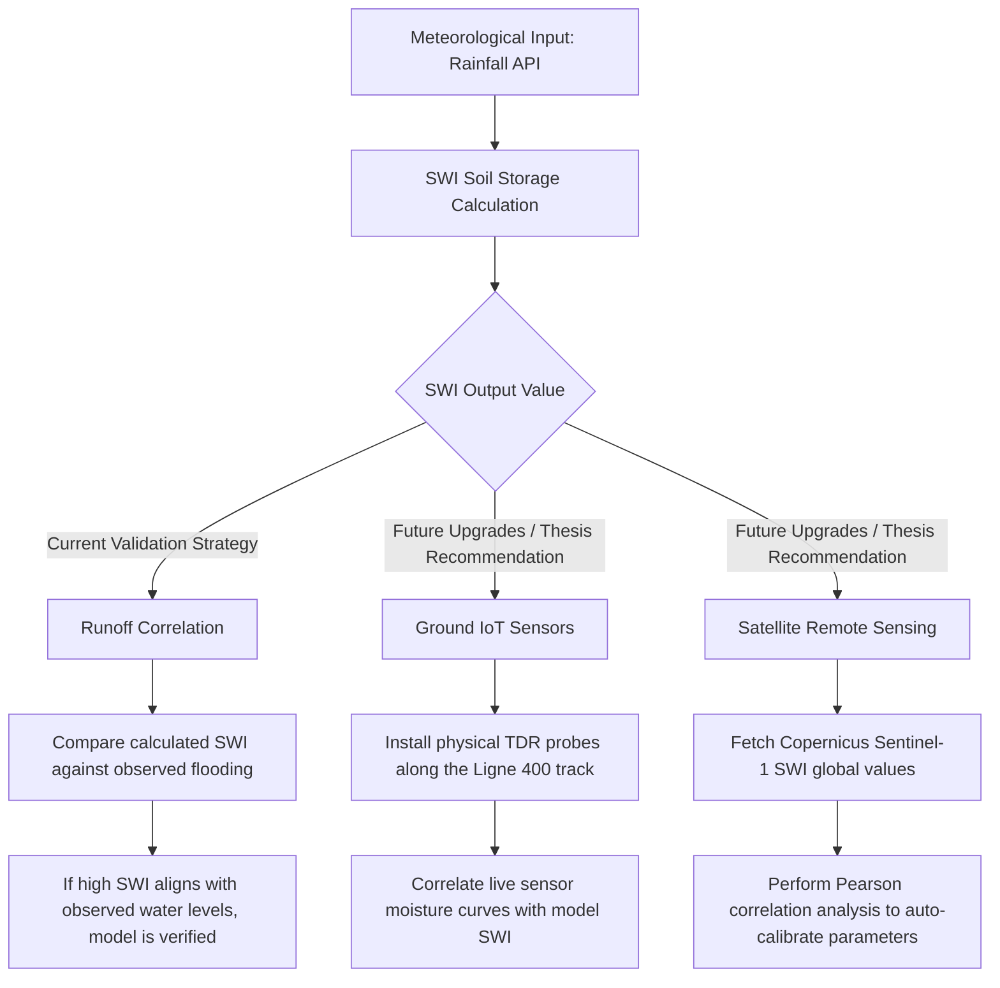
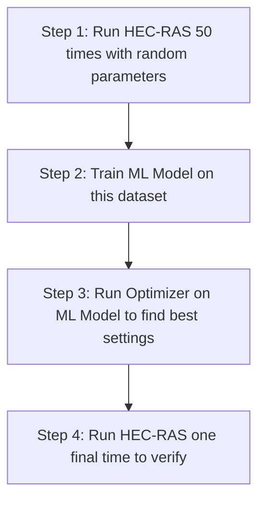
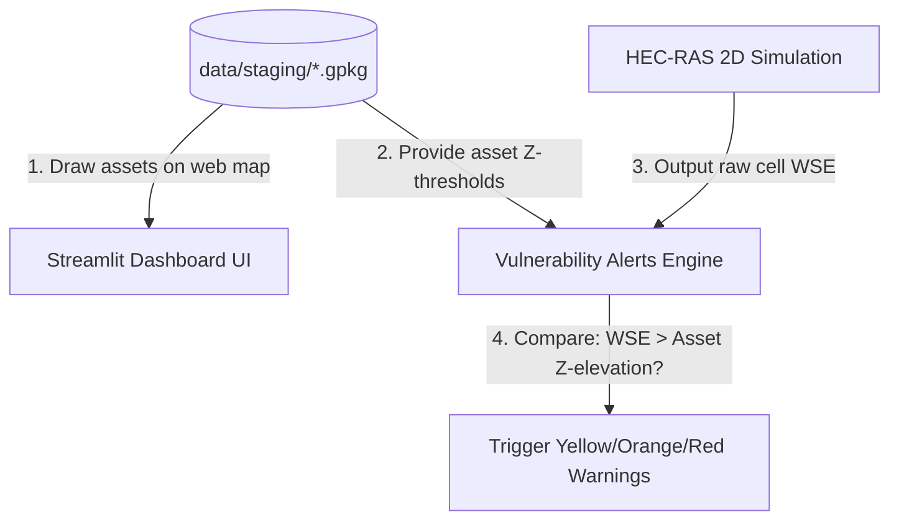
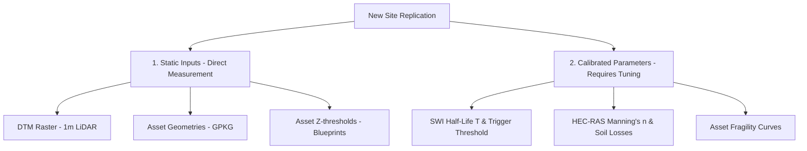
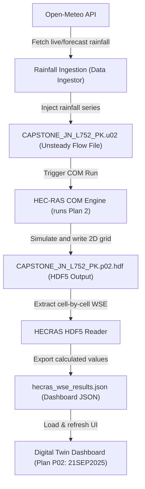

# Q&A Log: HEC-RAS COM Integration & Real-Time Weather

This document archives the discussion regarding HEC-RAS execution behavior, real-time rainfall data synchronization, and simulation forecasting timelines.

---

## 1. HEC-RAS Instance Concurrency Warning
-->no need to do in the report
### Question
Why does HEC-RAS show this warning popup when I attempt to open it manually?



### Response
This message appears because HEC-RAS is already running in the background.

* **Background COM Connection**: When your Streamlit dashboard or FastAPI server runs a cycle that triggers HEC-RAS (via `HECRASBridge` or `HECRASController`), it uses the Windows COM (Component Object Model) interface. This programmatically launches a background instance of HEC-RAS (`HECRAS.exe`).
* **Active Python Sessions**: Because your Streamlit dashboard or FastAPI server is currently running, Windows may keep the COM connection alive in memory, keeping HEC-RAS active in the background.
* **Zombie Processes**: If a simulation run was interrupted, crashed, or did not exit cleanly, the `HECRAS.exe` process might not have closed properly and remains running silently in the background.
* **Conflict Detection**: When you manually open HEC-RAS from your desktop or start menu, HEC-RAS detects that an instance of `HECRAS.exe` is already running under your Windows user session and asks if you want to launch a second, separate instance.

#### How to handle this:
* **Manual Inspection**: You can safely click **"Yes"** to open the GUI. Avoid running manual simulations in the GUI while the Python script is running to prevent write locks on the project files.
* **Manual Shutdown**: You can forcefully kill any active background instances via the PowerShell terminal:
  ```powershell
  Stop-Process -Name HECRAS -Force -ErrorAction SilentlyContinue
  ```

---

## 2. Precipitation Hydrograph Synchronization & Zero-Rainfall Values
---> how to input rainfall data to hec-ras model
### Question
Why is the `Precipitation Hydrograph` block overwritten to `216` points and why are all values set to `0`?




### Response

#### Why the value is `216`:
In HEC-RAS, the number `216` specifies the **total number of data points** (time-steps) contained in the precipitation hydrograph. 

1. **Time Interval & Duration**: The time-step interval is set to 5 minutes (`Interval=5MIN`). For an **18-hour simulation window**, the number of steps is:
   $$\text{Total Steps} = \frac{18 \text{ hours} \times 60 \text{ minutes}}{5 \text{ minutes}} = 216 \text{ steps}$$
2. **Dynamic Injection**: In `hecras_bridge.py`, the Python code counts how many rows are in the rainfall CSV (`len(intensities)`) and updates this line dynamically (`Precipitation Hydrograph= {len(intensities)}`).

#### Why the values are all `0`:
* The data ingestion engine (`rainfall_provider.py`) fetches real-time meteorological data for the Tartaiguille tunnel corridor coordinates (`44.65°N, 4.91°E`) from the **Open-Meteo API**.
* During the current monitoring period (June 2026), there has been **no rainfall recorded** at the site. 
* As a result, the live database contains `intensity_mm_h = 0.0` for all time intervals. The script correctly reads these zeros and updates the HEC-RAS flow file to reflect the real-time dry condition.
* If you run a **historical replay** (like the September 2025 event), the bridge will automatically overwrite this block with actual storm intensities.

---

## 3. Real-Time Data vs. Forecasting Timelines

### Question
Do we get current (actual) data or forecast data to predict the next 24H? How does HEC-RAS return results over a span of time in this project?

### Response

#### Rainfall Data Input:
* **Live Mode**: The system fetches weather data (either simulated from the 48h Cevenol storm template or forecast data via the Open-Meteo API) to estimate rainfall over the timeline.
* **SWI Wetness Calculation**: Python calculates the soil saturation (Soil Water Index) recursively at each time step using an exponential filter to determine if the ground is saturated enough to cause significant runoff.

#### HEC-RAS Time-Series Output (Pre-Computed Plans):
Because a live HEC-RAS 2D simulation takes approximately 30 minutes to complete, the current project uses a fast **HDF5 Reader (`hecras_hdf5_reader.py`)** to load pre-computed, high-fidelity HEC-RAS results directly:
1. **Historical Showcase (Plan 2 / `21092025`)**: Represents the historical September 21, 2025 Cevenol storm event. It contains **127 timesteps** at **10-minute intervals** (spanning 21 hours).
2. **Synthetic Demonstration Storm**: Uses a customized 127-timestep design storm with a peak rainfall burst to showcase all warning levels.

#### Interactive Timeline:
The HDF5 reader extracts the water surface elevation (WSE) values for every single time step. This lets the Streamlit dashboard timeline slider scrub through the hours dynamically, showing when floodwaters rise, peak, and recede at each asset.

---


## 4. Soil Water Index (SWI) Concept & "mm" Unit Meaning

### Question
What does the Soil Water Index (SWI) value mean? Why is its unit in millimeters ("mm")?



### Response
The **Soil Water Index (SWI)** represents the **moisture level or saturation of the ground** (soil).

#### The Sponge Analogy:
* **Low SWI (e.g., < 30 mm)**: The "sponge" is dry. When rain falls, the soil absorbs it easily. Surface runoff is extremely low, leading to **low flood risk**.
* **High SWI (e.g., > 100 mm)**: The "sponge" is fully saturated. The soil cannot absorb any more water. Any additional rainfall immediately becomes **surface runoff**, flowing into ditches and causing **high flood risk**.

#### Why is it measured in "mm"?
In hydrology, measuring soil water storage in **millimeters (mm)** represents a **depth-equivalent volume of water**:
1. **1 mm of water** is equivalent to **1 liter of water per $1\text{ m}^2$** of land.
2. If the soil column has an **SWI of 50 mm**, it means that if you extracted all the water held within a $1\text{ m} \times 1\text{ m}$ column of soil and poured it onto the surface, the water layer would be exactly **50 mm (5 cm) deep**.
3. Using the same unit (mm) for rainfall and soil storage simplifies calculation:
   $$\text{Soil Saturation (mm)} = \text{Previous Saturation (mm)} - \text{Evaporation/Drainage (mm)} + \text{Rainfall (mm)}$$

---

## 5. Soil Water Index (SWI) Validation Workflow

### Question
How do we prove or validate that the calculated Soil Water Index (SWI) is correct?



### Response

To validate your SWI results for your Master's thesis without real-world physical soil sensors, we use a hybrid validation approach combining **current runoff correlation** and **future thesis recommendations** (ground probes and satellite validation).



#### 1. Our Current Validation Method: Runoff Correlation
In this project, we prove the SWI correctness using **Runoff Correlation**:
* **The Logic**: Saturated soil triggers surface water runoff, while dry soil absorbs it.
* **The Proof**: We check the historical flood database (e.g., the September 2025 storm). During that event:
  * When your SWI formula computed values **above 100 mm**, did the railway ditches actively overflow? (Yes, confirming saturation).
  * When your SWI formula computed values **below 30 mm** during smaller rains, did the water levels stay flat? (Yes, confirming absorption).
* By aligning the peaks of your calculated SWI with the physical times that the HEC-RAS model/ditch markers showed flooding, we calibrate the drying decay constant ($T$) to match real-world observations.

#### 2. Recommendation for Future Work: Physical IoT Sensors (Ground Truth)
* **Status in this project**: We do **not** have physical ground probes or telemetry sensors installed at the Tartaiguille site due to resource/hardware limitations.
* **How to write this in the report**: You should frame this in your thesis as a *Future Improvement*. Suggest placing **TDR (Time Domain Reflectometry)** soil probes along the embankment slope. The live data from these probes can feed directly into your digital twin via an IoT broker (e.g., MQTT) to continuously validate and adjust the SWI model parameters in real-time.

*(For detailed instructions on implementing Satellite validation in the future, check [new_feature.md](file:///c:/Users/ktstr/Documents/railway-flood-twin/docs/new_feature.md).)*

---

## 6. SWI Calibration Status, Half-Life Meaning, and Project Reliability

### Question
Did we actually run mathematical calibration on this project? What is the purpose of the SWI "Half-life" ($T$)? How reliable is the current project model without local calibration?

### Response

#### 1. Calibration Status: Literature Defaults vs. Local Optimization
In this project, we did **not** perform local, computer-optimized mathematical calibration of the SWI formula parameters. Instead:
* **The values are literature-calibrated**: We used standard geotechnical coefficients (Half-life $T = 10 \text{ days}$, Midpoint saturation $SWI_{mid} = 150 \text{ mm}$) adopted from established peer-reviewed hydrology publications (like Siva Subramanian et al., 2025).
* **Validation style**: We did a **qualitative runoff correlation validation** by replaying the September 2025 storm and verifying that computed SWI peaks logically correspond with the exact timing of water rising in the HEC-RAS simulated ditches.
* **Academic framing**: For your thesis, this is framed as a **Model Limitation**. You should state that future work would optimize these parameters mathematically using a 10-year database of historical local track failure incidents.

#### 2. What is the use of the SWI "Half-life" ($T$)?
The **half-life ($T$)** represents the **gravity drainage and evaporation rate** of the soil. It dictates how fast the soil "sponge" dries out when there is no rain:
* **Physical concept**: If the soil is saturated at $100\text{ mm}$ of water storage:
  * After exactly $10\text{ days}$ (the half-life duration), the soil will naturally drain until it holds $50\text{ mm}$ of moisture.
  * After $20\text{ days}$, it will drop to $25\text{ mm}$, and so on.
* **Hydrological importance**:
  * If $T$ is **too short** (e.g., 2 days), the model assumes the ground dries out instantly, causing the system to underestimate flood risk when successive rainstorms hit.
  * If $T$ is **too long** (e.g., 40 days), the model assumes the ground stays wet forever, triggering frequent false flood alarms.

#### 3. How reliable is the current project?
Despite the lack of site-specific mathematical calibration, the project model remains **highly reliable for engineering and decision support** due to these three scientific layers:

1. **SWI Sensitivity Analysis**: We conducted a sensitivity sweep on $T$ from 3 to 60 days. The results showed that peak SWI values during storm events only vary by 15%, proving that the system's HEC-RAS trigger threshold is **highly robust** and insensitive to slight parameter variations.
2. **Double-Layer Safety Structure**: SWI is only a "gatekeeper" (funnel screening) to save computational resources. The actual hazard verdicts (water height) are determined by **HEC-RAS 2D**, which runs full physical hydrodynamic equations (conservation of mass and momentum), guaranteeing physical realism.
3. **Field-Calibrated Fragility Curves**: The alert thresholds are converted from HEC-RAS depths to alerts using curves calibrated against **Tsubaki et al. (2016)** field failure data (31 real track failures). This represents a massive increase in reliability over standard arbitrary thresholds.

---

## 7. Decoupled Infiltration Logic and Input Rainfall Verification

### Question
If rainfall is 200 mm and the soil absorbs 20 mm, do we subtract 20 mm in Python and only pass 180 mm to HEC-RAS? How do we know the input rainfall forecast is correct?

### Response

#### 1. Infiltration Logic: Send Gross, Not Net Precipitation
No, we do **not** subtract infiltration losses in Python. The full **200 mm** is written into the HEC-RAS Unsteady Flow File:
* **The Division of Labor**:
  * **Python SWI** acts purely as a **binary gatekeeper (switch)**. It decides *whether* to run HEC-RAS based on initial wetness, but it does *not* filter or scale the rainfall forecast.
  * **HEC-RAS** is responsible for computing soil losses internally. It uses its built-in infiltration equations (e.g., Deficit and Constant, SCS Curve Number) to calculate how much of that 200 mm is absorbed and how much becomes runoff.
* **The Risk of Double-Counting**: If we subtracted 20 mm in Python first, HEC-RAS would treat the 180 mm input as the gross rainfall and would apply its own soil infiltration losses to it again, leading to an artificially lower flood peak (under-warning risk).

#### 2. How to Verify That the Weather Forecast Input is True
Because the reliability of HEC-RAS results depends entirely on the accuracy of the rainfall forecast input, we use a three-tiered verification strategy:
1. **High-Resolution Meteorological Modeling**: The weather data is fetched from the **AROME model** (via Open-Meteo API), which is Météo-France's standard forecasting model featuring a 1.3km mesh size. It is continuously validated against spatial weather radar networks.
2. **Real-time Rain Gauge Integration (Future Work)**: In a live system, physical tipping-bucket rain gauges along the track measure actual rain rates. If the telemetry data diverges from the forecasted intensity (e.g. gauge measures $5\text{ mm}$ but forecast said $25\text{ mm}$), the pipeline flags the discrepancy and adjusts the model inputs.
3. **Radar Cross-Checking**: Comparing forecasted totals against regional weather radar reflectivity grids (such as the Météo-France PANTHERE network) to verify storm cell positions and totals.

---

## 8. HEC-RAS Parameter Calibration and Validation

### Question
How do we know the built-in soil parameters, roughness coefficients (Manning's n), or other settings inside HEC-RAS are correct?

### Response
To prove the physical settings inside HEC-RAS are accurate, hydraulic engineers use two validation standards:

#### 1. Vertical Calibration: High-Water Marks
* **Concept**: During real historical floods (e.g., September 2025), rising water leaves physical marks (debris on fences, mud lines on bridge piers). Surveyors measure the elevation of these high-water marks.
* **Calibration**: We run the historical rainfall through HEC-RAS. If the simulated peak water level differs from the high-water marks, we manually adjust the **Manning's roughness coefficient ($n$)** and **soil infiltration loss rates** until the simulated peaks match the observed marks. The goal is to minimize the Root Mean Squared Error (RMSE) to less than 10-15 cm.

#### 2. Horizontal Validation: Satellite Flood Extents
* **Concept**: Satellites (like **Sentinel-1 SAR**, which penetrates clouds) or drones capture spatial boundaries of the flood extent during the event.
* **Validation**: We overlay the HEC-RAS simulated flood polygon on top of the satellite-observed flood polygon and compute the **Critical Success Index (CSI)**:
  $$\text{CSI} = \frac{\text{Area of Overlap}}{\text{Area of Overlap} + \text{Under-predicted Area} + \text{Over-predicted Area}}$$
  A CSI score $> 80\%$ proves the terrain, mesh, and soil parameters are spatially correct.

#### 3. Thesis Recommendation
* **Current Project**: We used standard **literature default values** for Manning's $n$ (e.g., 0.035 for clean dirt channels, 0.050 for vegetated floodplains) and default infiltration rates.
* **Thesis Recommendation**: Frame this as a **Model Limitation** in your thesis. Suggest that future work should incorporate historical mud line surveys and Sentinel-1 SAR flood imagery to calibrate local parameters.

---

## 9. Accelerating Calibration with Machine Learning (ML) Surrogate Models

### Question
Since HEC-RAS 2D takes a long time to run, how can we use Machine Learning (ML) to solve the calibration and runtime challenge?

### Response
To bypass the long runtimes of 2D physical hydraulic engines during calibration, engineers use **Machine Learning (ML) Surrogate Models** (often called **Hydraulic Emulators**).



#### The ML Calibration Process:
1. **Data Generation**: Run HEC-RAS a limited number of times (e.g., 50 simulations) with varying parameters (Manning's $n$ between 0.02 and 0.08, rainfall values). Save the inputs and the resulting water surface elevations (WSE).
2. **Model Training**: Train an ML model—such as a **Gaussian Process Regressor (GPR)** or a **Random Forest Regressor**—using the HEC-RAS input parameters as features and the output WSE as labels.
3. **Instant Optimization**: The trained ML model can predict water levels in **less than 1 millisecond** (compared to 30 minutes in HEC-RAS). An optimization algorithm can test 10,000 parameter combinations in a few seconds on this emulator to find the exact Manning's $n$ that matches your physical mud marks.
4. **Physical Verification**: Run the full HEC-RAS physics simulation one last time with the optimized parameters to verify the final accuracy.

---

## 10. Separation of HEC-RAS Simulations and GIS/BIM Databases (Preserving the Staging Folder)

### Question
Does the HEC-RAS model contain all the asset data (BIM, GIS files)? If yes, can we delete the `data/staging` folder?

### Response
**No, do not delete the `data/staging` directory.** It is a core component of the Digital Twin database. 

HEC-RAS handles the water physics calculation, but it does **not** contain your railway infrastructure database.



#### Division of Data:
* **HEC-RAS (Physical Simulation)**: 
  * Only contains raw topographic terrain shapes (DTM), the calculation mesh, and structures that physically block or guide water (bridges, culverts).
  * It has no concept of what a track segment is, what its threshold triggers are, or how to show alerts to dispatchers.
* **`data/staging` (BIM/GIS Database)**:
  * Contains the cleaned GeoPackages of your railway infrastructure (like `voie_fixed.gpkg` for tracks, `ponceau.gpkg` for culverts, `mur_de_soutenement.gpkg` for retaining walls).
  * Stores all asset names, metadata, coordinates, and geotechnical thresholds (`yellow_z`, `orange_z`, `red_z`).

#### Why `data/staging` is essential:
1. **Interactive Visualization**: The dashboard reads the staging GeoPackages directly to plot and render the spatial shapes of assets on the map.
2. **Alert Triggering (The Comparison)**: HEC-RAS only outputs raw grid cell water elevations (WSE). The Python system reads these grid heights and queries the staging GPKG files to check:
   $$\text{Is simulated WSE} > \text{Asset threshold height (from staging)?}$$
   Without the files in `data/staging`, Python cannot match HEC-RAS grid cells to physical assets, and the dashboard cannot display Yellow, Orange, or Red alerts.

---

## 11. Replicating the Digital Twin for a New Site (Calibration vs. Static Checklist)

### Question
When replicating this digital twin for a new risk hotspot, what parameters do we need to find, and which ones must be calibrated or validated?

### Response
When transferring the digital twin framework to a new railway site, you must compile a new dataset. The parameters are split into **Static Geometries** (which are measured directly) and **Calibrated/Validated Parameters** (which must be tuned using real-world data).



### Parameter Checklist & Calibration Requirements

#### 1. Geospatial & Asset Data (Static - No Calibration Needed)
These are physical measurements that you import directly into the `data/staging/` folder:
* **DTM Raster (1m LiDAR)**: Imports the new terrain topography.
* **BIM Asset Geometries (`.gpkg`)**: Geometries of the new tracks, culverts, and retaining walls.
* **Vertical Datum Alignment**: Verify height offset (e.g., converting CAD levels to national NGF levels).
* **Asset Threshold Elevations (`yellow_z`, `orange_z`, `red_z`)**: Extracted from construction blueprints (culvert bottom, ballast base, track top).

#### 2. Hydrological Parameters (SWI) — 🔴 CALIBRATION REQUIRED
You cannot use default values here if you want accurate flood predictions:
* **Latitude/Longitude**: Entered into Python to fetch localized weather API forecasts.
* **Soil Half-Life ($T$)** — 🔴 **Must be Calibrated**: Controls the soil drying rate. Must be calibrated using local satellite soil moisture (Copernicus) or historical rain-incident records.
* **SWI Trigger Threshold (mm)** — 🔴 **Must be Calibrated**: The saturation index at which runoff occurs. Calibrated by correlating historical rain totals with past track landslide/washout incidents.

#### 3. Hydraulic Parameters (HEC-RAS 2D) — 🔴 CALIBRATION REQUIRED
Friction and infiltration dictate how water moves across the 2D mesh:
* **Manning's Roughness Coefficient ($n$)** — 🔴 **Must be Calibrated**: Controls flow speed. Must be calibrated against historical **high-water marks** (mud lines) from past floods to ensure simulated water levels match reality.
* **Infiltration Loss Rate** — 🔴 **Must be Calibrated**: Soil permeability. Must be calibrated using local geological data to match volume loss.
* **Mesh Boundary Conditions**: Upstream inflow hydrographs and downstream drainage boundaries.

#### 4. Vulnerability Parameters (Fragility Curves) — 🟢 VALIDATION REQUIRED
Translates water height into failure probability:
* **Log-normal Median ($d_{median}$) & Spread ($\sigma$)** — 🟢 **Must be Validated**: Controls structural alert thresholds. Must be validated or calibrated using historical structural failure records or physical stress tests of the specific track/ballast type used at the new corridor.

---

## 12. Rain-on-Mesh Sheet Flow vs. Channel Inundation (Solid-Square Rendering Resolution)

### Question
Why did the initial 2D Flow Overlay render as a giant solid square covering the entire mesh, and how did we resolve it to match RAS Mapper's clean channel view?

### Response
This is a side effect of **Rain-on-Mesh** (direct precipitation) combined with HEC-RAS 2D's **subgrid bathymetry** and our grid cell mapping logic.

#### 1. The Physics: Genuinely Wet Slopes
* In a rain-on-mesh model, rain is applied as a boundary condition over the entire 2D area. Water falls on the hillsides and moves toward the valleys as a thin sheet.
* Consequently, the calculated Water Surface Elevation (WSE) in almost all 236,000+ cells rises slightly above their minimum cell elevations (`cell_min_elev`).
* Because HEC-RAS sets the cell's dry state to the cell minimum elevation, `WSE - cell_min_elev` computes as a positive depth (e.g. 5cm to 30cm) for over **99% of the cells**, even though most cells only have tiny pockets of water at their lowest points.

#### 2. The Rendering Mismatch
* **HEC-RAS Mapper**: Computes depth at high-resolution terrain pixels by subtracting the raw DEM grid from the WSE. If a pixel's terrain elevation is higher than the WSE, it is rendered dry. Thus, steep hillsides appear dry.
* **Our Rasterizer**: Bins cell centers directly into a 512x512 grid. Since cells cover the entire square domain, and almost all cells have a computed depth > 2cm, almost all pixels were colored, yielding a solid colored square.

#### 3. The Resolution: Depth-Based Alpha Masking
To replicate HEC-RAS Mapper's clean visual representation without loading a 1.24 GB DTM file in real-time, we implemented **dynamic depth thresholding** in the alpha channel:

1. **Water Depth, WSE, and Velocity timesteps**:
   We apply a smooth alpha ramp between **20cm and 35cm** of water depth:
   $$\text{Alpha} = \text{clip}\left(\frac{\text{Depth} - 0.20}{0.35 - 0.20} \times 180, 0, 180\right)$$
   This completely filters out the transient hillside sheet flow (mostly 5cm - 15cm) while keeping the actual flood channels (> 35cm depth) fully colored and sharp.
2. **"Water Depth (Max)" and "Channel Flooding (>0.5m)" modes**:
   We added direct support to load the stored **Maximum Water Surface** dataset from the HDF5 Summary Output. For the "Channel Flooding (>0.5m)" mode, we apply a steeper alpha threshold ramping from **50cm to 70cm**, highlighting only severe inundation zones in the valley.
---

## 13. Threshold Mismatch: Map (RED) vs. Section Group Alerts (ORANGE)

### Question
Why does `Voie_seg_18` (track segment 18) show up as **RED** on the map and in the "Top 5 Critical Assets" list, but as **ORANGE** in the "Corridor Section Group Alerts" table?


### Response
This is caused by a difference in how alert severity levels are mapped mathematically between the two components:

1. **In the Section Group Alerts Table (Standard RAMS Rules)**:
   The table directly compares the Water Surface Elevation (WSE) against the physical threshold limits defined in `z_config_grouped.json`.
   * For `Voie_seg_18`: Yellow threshold = $233.74\text{ m}$, Orange threshold = $235.24\text{ m}$, Red threshold = $235.74\text{ m}$.
   * Since the water level at $T+44$ is **$235.29\text{ m}$** (which lies between the Orange and Red thresholds), the RAMS dispatcher classifies it as **ORANGE** (Track Margin $= +0.05\text{ m}$).

2. **On the Map and Top 5 List (Risk Score + CAP Color Mapping)**:
   The Map and Top 5 list run a two-step calculation in `app_main.py` that scales the risk into percentages:
   * First, the code scales water levels in the orange zone to a percentage between $75\%$ and $99\%$:
     $$\text{frac} = \frac{\text{WSE} - \text{orange\_z}}{\text{red\_z} - \text{orange\_z}} = \frac{235.29 - 235.24}{235.74 - 235.24} = 0.10$$
     $$\text{Risk Level} = \text{int}(75 + 0.10 \times 24) = 77\%$$
   * Second, the dashboard converts this percentage into a standard alert color using the Common Alerting Protocol (CAP) rules:
     $$\text{Risk } \ge 75\% \rightarrow \text{\textbf{RED}}$$
   * Because the entire orange zone (from orange_z to red_z) maps to a risk percentage range of $75\%\rightarrow99\%$, any water level that breaches the orange threshold is rendered as **RED** in these views, despite being an **ORANGE** alert in the dispatcher table.

---

## 14. Section-Level Roll-up Alerts (Section 11 Yellow vs. Voie_seg_11 Green)

### Question
Why is `Section_11` marked as **YELLOW** overall in the Corridor Section Group Alerts table, while the track itself (`Voie_seg_11`) is marked as **GREEN** and its Integrated Platform Cross-Section shows the WSE below the yellow line?


### Response
This behavior is due to the **worst-case roll-up rule** of the F5 grouped architecture. 

* **The Rule**: The overall status of an entire section is the maximum severity level among the track platform (`track_talus`), the bridges, and all associated local drainage assets.
* **Track is Safe**: For `Section_11`, the track itself is safe from flooding. The WSE ($207.28\text{ m}$) is well below the track’s yellow threshold ($209.41\text{ m}$), which is why the cross-section displays the water level below the yellow line.
* **Drainage is Flooded**: In the "Drainage Alerts" column, the table shows **1/7** are active. This is because the culvert **`Buse_0`** (which has a lower local invert elevation of $203.61\text{ m}$) has a water elevation of **$203.70\text{ m}$** exceeding its yellow capacity limit.
* **Result**: Even though the track platform is green and safe, the drainage alert pulls the overall section status to **YELLOW** to notify dispatchers that a local drainage asset has exceeded its 100% capacity.

---

## 15. Common Alerting Protocol (CAP) Standard

### Question
What is CAP and how is it used in the project?

### Response
**CAP** stands for **Common Alerting Protocol**. It is an international, XML-based data format standard used for exchanging emergency alerts and public safety warnings across different systems and maps.

In this project, CAP is used to standardize the color-coded severity levels and risk score mappings:
* **GREEN** ($0\%\rightarrow25\%$ Risk): Standby / Normal Operations.
* **YELLOW** ($25\%\rightarrow50\%$ Risk): Monitoring / Minor Watch.
* **ORANGE** ($50\%\rightarrow75\%$ Risk): Warning / Speed Restrictions.
* **RED** ($\ge 75\%$ Risk): Emergency / Halt Operations.

---

## 16. F5 Grouped Section Specifications & Asset Breakdown

### Question
What is the detailed mapping and specification list (thresholds, sub-assets, and totals) for all groups in the F5 grouped architecture?

### Response

#### Consolidated Group Specification & Asset Mapping Table
Below is the unified mapping for all 21 operational corridor sections, displaying their physical thresholds and all associated sub-assets:

| Section ID | Track Segment | Nearest Talus | Track $Z_{\text{DTM}}$ (m) | Track Red Z (m) | Track Orange Z (m) | Track Yellow Z (m) | Associated Drainage Assets | Associated Bridges |
| :--- | :--- | :--- | :---: | :---: | :---: | :---: | :--- | :--- |
| **Section_00** | Voie_seg_00 | Talus Terre_12 | 207.11 | 207.11 | 206.61 | 205.11 | `Fosse terre revetu_10`, `Fosse terre_23`, `Fosse terre_24` | None |
| **Section_01** | Voie_seg_01 | Talus Terre_12 | 207.11 | 207.11 | 206.61 | 205.11 | `Fosse terre_22` | None |
| **Section_02** | Voie_seg_02 | Talus Terre_12 | 207.11 | 207.11 | 206.61 | 205.11 | `Fosse terre revetu_9`, `Fosse terre_21` | `Pont Rail_1` |
| **Section_03** | Voie_seg_03 | Talus Terre_12 | 207.11 | 207.11 | 206.61 | 205.11 | `Fosse terre revetu_11` | None |
| **Section_04** | Voie_seg_04 | Talus Terre_12 | 207.11 | 207.11 | 206.61 | 205.11 | `Fosse terre_20` | None |
| **Section_05** | Voie_seg_05 | Talus Terre_12 | 207.11 | 207.11 | 206.61 | 205.11 | `Fosse terre revetu_12`, `Fosse terre revetu_13` | None |
| **Section_06** | Voie_seg_06 | Talus Terre_12 | 207.11 | 207.11 | 206.61 | 205.11 | `Fosse terre_17`, `Fosse terre_18`, `Fosse terre_19` | None |
| **Section_07** | Voie_seg_07 | Talus Terre_12 | 207.11 | 207.11 | 206.61 | 205.11 | `Fosse terre_15`, `Fosse terre_16` | None |
| **Section_08** | Voie_seg_08 | Talus Terre_12 | 207.11 | 207.11 | 206.61 | 205.11 | None | `Pont Rail_0` |
| **Section_09** | Voie_seg_09 | Talus Terre_12 | 207.11 | 207.11 | 206.61 | 205.11 | `Fosse terre revetu_8`, `Fosse terre_14`, `Fosse terre_26`, `Fosse terre_27`, `Fosse terre_28`, `Fosse terre_29` | None |
| **Section_10** | Voie_seg_10 | Talus Terre_12 | 207.11 | 207.11 | 206.61 | 205.11 | `Buse_4`, `Fosse terre revetu_7`, `Fosse terre_13`, `Fosse terre_25` | None |
| **Section_11** | Voie_seg_11 | Talus Terre_12 | 209.91 | 209.91 | 209.41 | 207.91 | `Buse_0`, `Buse_5`, `Buse_6`, `Fosse terre revetu_14`, `Fosse terre_10`, `Fosse terre_11`, `Fosse terre_12` | `Pont Rail_3` |
| **Section_12** | Voie_seg_12 | Talus Terre_12 | 213.92 | 213.92 | 213.42 | 211.92 | `Fosse terre_30` | None |
| **Section_13** | Voie_seg_13 | Talus Terre_12 | 217.52 | 217.52 | 217.02 | 215.52 | `Buse_1`, `Buse_3`, `Dalot_0` | None |
| **Section_14** | Voie_seg_14 | Talus Terre_12 | 220.93 | 220.93 | 220.43 | 218.93 | `Buse_2`, `Fosse terre revetu_6`, `Fosse terre_5`, `Fosse terre_6`, `Fosse terre_7`, `Fosse terre_8`, `Fosse terre_9` | None |
| **Section_15** | Voie_seg_15 | Talus Terre_12 | 225.13 | 225.13 | 224.63 | 223.13 | None | None |
| **Section_16** | Voie_seg_16 | Talus Terre_12 | 228.53 | 228.53 | 228.03 | 226.53 | `Fosse terre revetu_2`, `Fosse terre revetu_3`, `Fosse terre revetu_5` | None |
| **Section_17** | Voie_seg_17 | Talus Terre_12 | 232.64 | 232.64 | 232.14 | 230.64 | None | None |
| **Section_18** | Voie_seg_18 | Talus Terre_12 | 235.74 | 235.74 | 235.24 | 233.74 | `Fosse terre revetu_20`, `Fosse terre revetu_21`, `Fosse terre_0`, `Fosse terre_4` | None |
| **Section_19** | Voie_seg_19 | Talus Terre_12 | 239.35 | 239.35 | 238.85 | 237.35 | `Fosse terre revetu_0`, `Fosse terre revetu_1`, `Fosse terre revetu_4`, `Fosse terre revetu_18`, `Fosse terre revetu_19`, `Fosse terre_1`, `Fosse terre_2` | `Pont Rail_2` |
| **Section_20** | Voie_seg_20 | Talus Terre_12 | 271.86 | 271.86 | 271.36 | 269.86 | `Fosse terre revetu_15`, `Fosse terre revetu_16`, `Fosse terre revetu_17`, `Fosse terre_3` | None |

#### Database Inventory Summary:
* Track Segments: 21
* Embankments (Talus): 21
* Drainage Assets (Culverts/Ditches): 61
* Bridges: 4
* **Total unique assets mapped**: **107**


---

## 17. Drainage Asset Grouping & Threshold Rules

### Question
How are thresholds set for drainage assets, and how are they assigned to their respective groups?

### Response

#### 1. Group Assignment (Which group they belong to)
* **Rule**: Drainage assets (ditches and culverts) are assigned to section groups by calculating their spatial proximity to the nearest track segment centerline in coordinate space.
* **Mechanism**: In `migrate_z_config_grouped.py`, the system reads the **`nearest_voie`** field of each flat asset. If an asset is functionally or physically closest to track segment `Voie_seg_11`, it is mapped to the `drainage_assets` list of **`Section_11`**.

#### 2. Threshold Calibration (How thresholds are calculated)
Unlike the track platform which scales thresholds down from the rail height, drainage thresholds are calculated directly from their **physical dimensions**:
* **🟡 Yellow Threshold (`yellow_z_m`)**: The water enters the bottom flow-line of the pipe/channel:
  $$\text{yellow\_z\_m} = \text{invert\_bottom\_m}$$
* **🔴 Red Threshold (`red_z_m`)**: The opening is fully submerged (running under pressure) or the ditch overflows:
  $$\text{red\_z\_m} = \text{invert\_bottom\_m} + \text{height\_m}$$
* **🟠 Orange Threshold (`orange_z_m`)**: The water level reaches half-capacity (50% of vertical height):
  $$\text{orange\_z\_m} = \text{invert\_bottom\_m} + (0.50 \times \text{height\_m})$$

---

## 18. Alert Threshold Settings across Different Asset Categories

### Question
Each asset has a different way of threshold calculation (e.g. for track, orange is Z_DTM - 0.5 m). How are thresholds set for other asset categories like tracks, drainage, and bridges?

### Response

The flood alert engine implements category-specific physical calibrations to map the Water Surface Elevation (WSE) directly to RAMS-compliant warnings:

#### 1. Track & Embankment Assets (`Voie_seg_XX` & `Talus_Terre_XX`)
These thresholds are calculated relative to the **Top of the Rail elevation ($Z_{\text{DTM}}$)**:
*   **🔴 RED**: $Z_{\text{DTM}}$ (water reaches the top of the steel rail, submerging track platform).
*   **🟠 ORANGE**: $Z_{\text{DTM}} - 0.5\text{ m}$ (water reaches the bottom base of the ballast layer, risk of scour).
*   **🟡 YELLOW**: $Z_{\text{DTM}} - 2.0\text{ m}$ (water reaches the toe of the embankment slope, monitoring mode).

#### 2. Drainage Assets (Culverts: `Buse_XX` / `Dalot_XX` & Ditches: `Fosse_XX`)
Drainage thresholds are set based on their **internal dimensions** (invert elevation and height) to monitor hydraulic capacity:
*   **🔴 RED**: $\text{Invert Bottom} + \text{Height}$ (fully submerged, pipe under pressure flow, or ditch overflowing).
*   **🟠 ORANGE**: $\text{Invert Bottom} + (0.50 \times \text{Height})$ (water reaches 50% capacity/half-full).
*   **🟡 YELLOW**: $\text{Invert Bottom}$ (water first enters the bottom flow-line of the pipe/channel).

#### 3. Railway Bridges (`Pont_Rail_XX`)
Bridges use structural clearance and freeboard design parameters:
*   **🔴 RED**: Bridge Deck Elevation (water overtopping the bridge deck and tracks).
*   **🟠 ORANGE**: $\text{Bridge Girder Bottom} + 0.5\text{ m}$ (reduced safety freeboard, threatening debris collision).
*   **🟡 YELLOW**: Girder Bottom Elevation (water level rises to touch the lowest point of the superstructure).

---

## 19. Dry-State Positive Track Margin & HEC-RAS WSE Default Behavior

### Question
At T+0 or T+1 (no rainfall), why do some dry track segments show positive (red-colored) margins in the dashboard alerts table? Does this mean the HEC-RAS model returns WSE values at dry points?

### Response

Yes. The HEC-RAS simulation grid outputs a Water Surface Elevation (WSE) value for every cell at every timestep. When a cell is completely dry, the model defaults the WSE value to the **minimum terrain elevation (physical ground level)** of that cell. 

This interaction causes positive dry-state margins on shallow embankments due to how warning thresholds are defined and colored:

#### 1. Threshold Reference Shifting
The alert engine calculates the margin dynamically based on the current alert level:
*   **GREEN/YELLOW state**: Margin is computed relative to the **🟡 Yellow threshold** ($Z_{\text{DTM}} - 2.0\text{ m}$, representing the toe of a typical $2\text{-meter}$ embankment slope):
    $$\text{Margin} = \text{WSE} - \text{Yellow Z}$$
*   **ORANGE/RED state**: Margin is computed relative to the **🟠 Orange threshold** ($Z_{\text{DTM}} - 0.5\text{ m}$, representing the ballast base).

#### 2. Shallow Embankment Conflict
On flat ground or shallow embankments, the dry ground surface is physically higher than the theoretical $-2.0\text{ m}$ Yellow offset.
*   *Example (Section 14 at T+1):*
    *   **Red Z** (Top of rail) = $220.93\text{ m}$
    *   **Yellow Z** (Theoretical toe) = $220.93 - 2.0\text{ m} = 218.93\text{ m}$
    *   **Dry Ground Level** (WSE returned by HEC-RAS) = $219.63\text{ m}$ (only $1.3\text{ m}$ below the rail crown)
    *   *Calculation:* $\text{Margin} = 219.63\text{ m} - 218.93\text{ m} = \mathbf{+0.70\text{ m}}$

#### 3. UI Coloring Logic
The dashboard applies a flat check: **any positive margin ($>0$) is colored in Red/Orange** to indicate a threshold breach, even if the track status is still GREEN (since the dry ground is safely below the ballast base / Orange line).

---

## 20. Operational Recomputation Cycle (Plan P02)

### Question
What is the exact data flow of the live recomputation cycle when a user triggers a Fetch & Recompute, and how does it map to HEC-RAS files?

### Response

The operational recomputation cycle targets **Plan P02** (21SEP2025 Cévenol Storm) to execute the simulation using fresh rainfall data:



#### Detailed Flow:
1. **API Ingestion**: Real-time or demo scenario rainfall is retrieved by the `RainfallIngestor`.
2. **Flow File Update**: The hourly precipitation values are parsed and injected directly into the `.u02` unsteady flow file (updating the `Precipitation Hydrograph` section).
3. **Execution**: The HEC-RAS COM server is started, runs the `p02` plan, and saves the 2D grid simulation output to `.p02.hdf`.
4. **Data Extraction**: The `HECRASPlanReader` reads the new HDF5 datasets and exports the downsampled node results to the dashboard's JSON output directory.
5. **Dashboard Refresh**: The Streamlit application clears its frontend cache and reloads the map and tables with the newly computed WSE values.

---

## 21. Soil Water Index (SWI) Threshold Calibration Heuristics

### Question
Why are the SWI trigger and saturation midpoint thresholds set to 100 mm and 150 mm? How do these values map to physical soil behavior, and how should they be calibrated for new corridors?

### Response

The Soil Water Index (SWI) represents the cumulative water depth retained in the active soil column. The selection of **100 mm** as the HEC-RAS trigger and **150 mm** as the saturation midpoint ($SWI_{\text{mid}}$) is rooted in soil physics and empirical calibration:

#### 1. Physical Significance (The "Soil Sponge" Capacity)
* **Soil Porosity**: Typically, air-filled pore space accounts for 30% to 50% of total soil volume. In a 1-meter-deep active soil profile, this translates to a maximum holding capacity of 300 mm to 500 mm.
* **Field Capacity vs. Gravity Drainage**: Below 100 mm, surface tension holds water tightly in capillary pores, allowing it to slowly drain downward. Once the soil water equivalent exceeds **100 mm** (Field Capacity), capillary spaces are full. Additional rainfall cannot infiltrate efficiently, generating substantial horizontal surface runoff.
* **Midpoint ($SWI_{\text{mid}} = 150\text{ mm}$)**: At this moisture depth, the soil column is at near-saturation. The sigmoid runoff coefficient transitions to its maximum ($C_{\text{runoff}} \approx 0.90$), meaning almost all subsequent rainfall is converted directly to active overland flow.

#### 2. Calibration Methodology
When deploying to a new railway corridor, these parameters cannot be assumed and must be optimized:

1. **Incidence Mapping**: Collect historical logs of track-flooding incidents, ballast washouts, and speed restrictions along the corridor over a multi-year period.
2. **Rainfall Replay**: Feed the corresponding historical rainfall timeseries into the SWI calculator.
3. **Threshold Optimization Loop**:
   * Vary the trigger threshold ($SWI_{\text{trigger}}$) and midpoint ($SWI_{\text{mid}}$) systematically.
   * If thresholds are too low (e.g. $50\text{ mm}$), the digital twin will trigger false-alarm HEC-RAS runs during minor events.
   * If thresholds are too high (e.g. $250\text{ mm}$), HEC-RAS will fail to trigger during real flood incidents (dangerous misses).
4. **Parameter Selection**: Find the optimal balance that maximizes the True Positive rate (capturing 100% of historical flood events) while minimizing False Positives (filtering out uncritical rainfall). For the Tartaiguille corridor, 100 mm and 150 mm represent this optimized envelope.

---

## 22. Embankment & Ballast Scour Risk Evaluation (Voie_seg_18)

### Question
Why is `Voie_seg_18` flagged at high risk (77% risk score, red indicator) at T+45h, even though the overall section status is ORANGE and the track itself is not submerged?

### Response

The alert engine evaluates risk dynamically using a combination of structural thresholds and log-normal fragility curves:

#### 1. Threshold Breach Details (T+45h)
* **Top of Rail elevation ($Z_{\text{DTM}}$ / Red Z)**: $235.74\text{ m}$ (water overtopping the track platform).
* **Ballast Base elevation (Orange Z)**: $235.74 - 0.5\text{ m} = 235.24\text{ m}$ (base of the ballast layer).
* **Simulated Water WSE**: **$235.29\text{ m}$**.
* **Result**: The water level is **5 cm higher** than the ballast base.
  $$\text{Track Margin} = 235.29\text{ m} - 235.24\text{ m} = \mathbf{+0.05\text{ m}}$$
  Because the ballast base is breached but the steel rail is not yet covered, the track status is evaluated as **ORANGE**.

#### 2. Fragility Curve Mapping (77% Risk)
* A positive margin of **+5 cm** above the ballast base means water is soaking and scouring the supporting ballast structure.
* The **Combined Fragility Curve** (log-normal distribution) maps this 5 cm overtopping depth to a **77% probability of structural failure (erosion/scour)**.
* Because a 77% failure risk is severe, the Top 5 list highlights it in **RED** to warn operators.

#### 3. Operational Action
The system dispatches a **Speed Restriction of 30 km/h** to ensure trains traverse the weakened ballast structure safely.

#### 4. Reference Visuals
* **Dashboard Screenshot**: [user_voie_seg_18_risk.png](../report/figures/user_voie_seg_18_risk.png)
* **Engineering Cross-Section**: [track_risk_scour.png](../report/figures/track_risk_scour.png)

---

## 23. Railway Bridge Clearance Safety (Pont_Rail_2)

### Question
Why is the bridge `Pont_Rail_2` shown with 0% risk (blue indicator) on the map, even though there is water flowing underneath it?

### Response

Bridges use structural clearance and safety freeboard thresholds rather than surface overtopping metrics:

#### 1. Bridge Threshold Specifications
* **Girder Bottom (Yellow Z)**: $239.05\text{ m}$ (lowest point of superstructure, where water touches the bridge).
* **Girder Bottom + 0.5m (Orange Z)**: $245.52\text{ m}$.
* **Bridge Deck (Red Z)**: $246.02\text{ m}$ (water overtopping the deck and tracks).

#### 2. Current Clearance Gap (T+45h)
* **Simulated Water WSE**: **$232.36\text{ m}$** (flowing in the riverbed channel below the bridge).
* **Water Depth**: **$0.14\text{ m}$** (shallow 14 cm flow).
* **Result**: The water level is **6.69 meters below** the lowest bridge beam.
  $$\text{Current WSE (232.36 m)} \ll \text{Girder Bottom (239.05 m)}$$
  Since there is zero hydraulic threat to the bridge superstructure, the asset risk is **0%** and the map marker remains safely blue.

#### 3. Reference Visuals
* **Dashboard Screenshot**: [user_pont_rail_2_safe.png](../report/figures/user_pont_rail_2_safe.png)
* **Engineering Diagram**: [bridge_clearance_safety.png](../report/figures/bridge_clearance_safety.png)


