# 🎓 Master Thesis Defense Presentation
## Railway Flood-Risk Digital Twin for the SNCF Tartaiguille Corridor

> **Author**: Tin Luan  
> **Program**: Master's Thesis — Digital Twin for Rail Infrastructure  
> **Defense Date**: July 2026  
> **Duration**: 15–20 minutes presentation + 10 minutes Q&A  

---

## Slide Structure Overview

| Slide # | Title | Duration | Key Visual |
| :---: | :--- | :---: | :--- |
| 1 | Title Slide | 30s | Project title, university logo, corridor photo |
| 2 | Problem Statement | 1 min | Cévenol storm photo + flood damage statistics |
| 3 | Research Objectives | 1 min | 5-point objectives bullet list |
| 4 | Study Area & Corridor Map | 1 min | Tartaiguille corridor map (Lambert 93) |
| 5 | Literature Review & DT Maturity | 1.5 min | DT maturity comparison table |
| 6 | 4-Layer Funnel Architecture | 2 min | **Mermaid flowchart** |
| 7 | Layer 2: SWI Leaky Bucket Model | 1.5 min | SWI formula + `Fig05_SWI_Storm_Response.png` |
| 8 | Layer 3: HEC-RAS 2D & HDF5 Reader | 1.5 min | HEC-RAS HDF5 data flow diagram |
| 9 | Layer 4: Group-Based Alert Architecture | 2 min | Section grouping diagram + threshold table |
| 10 | Dashboard Demo (Screenshots) | 2 min | `report_dashboard_overview.png` + `report_cross_section_focus.png` |
| 11 | Validation: SWI Sensitivity | 1 min | `Fig06_SWI_Sensitivity_T.png` |
| 12 | Validation: Fragility Curves | 1 min | `Fig07_Fragility_Comparison.png` |
| 13 | Historical Storm Replay | 1 min | `Fig08_Historical_Storm_Replay.png` |
| 14 | Limitations & Roadmap | 1 min | Gantt chart (Mermaid) |
| 15 | Conclusion & Contributions | 1 min | 4 key contributions |
| 16 | Thank You / Q&A | — | Contact info |

---

## Slide 1: Title Slide

**Content:**
- **Title**: "Railway Flood-Risk Digital Twin for the SNCF Tartaiguille Corridor"
- **Subtitle**: "A 4-Layer Architecture for Predictive Flood Alert Management"
- **Author**: Tin Luan
- **Supervisor(s)**: [Insert supervisor names]
- **University**: [Insert university name]
- **Date**: July 2026
- **Visual**: A background image showing the Tartaiguille railway corridor or a stylized flood-risk visualization.

---

## Slide 2: Problem Statement

**Key Messages:**
- Cévenol storms deliver **200+ mm** rainfall in **24 hours** in southern France.
- Flash floods threaten **track stability**, **ballast integrity**, and **drainage capacity**.
- SNCF's RISK-VIP program (Cheetham et al., 2016) confirmed that **periodic inspection cannot capture temporal flood dynamics**.
- **Need**: A real-time, predictive monitoring system — a Digital Twin.

**Visual:**
- A dramatic photo or illustration of a flooded railway track.
- Inset map showing the Drôme department in France.

---

## Slide 3: Research Objectives

**Content (5 Objectives):**
1. **Screen** the corridor using a Soil Water Index (SWI) to detect soil saturation.
2. **Simulate** flood hydraulics via pre-computed HEC-RAS 2D results (HDF5 reader).
3. **Group** assets by section to align hydraulic outputs with structural dependencies.
4. **Evaluate** structural vulnerability using calibrated fragility curves (Tsubaki et al., 2016).
5. **Dispatch** RAMS-compliant traffic-light alerts to operations control.

---

## Slide 4: Study Area & Data

**Content:**
- **Corridor**: Ligne 400 (Montélimar–Marseille), Tartaiguille Section
- **Coordinates**: 44.6559°N, 4.9172°E
- **DTM**: 1m LiDAR resolution, EPSG:2154
- **Assets**: 107 BIM assets across 21 sections

**Visual:**
- A corridor overview map (from GIS/QGIS export) with asset markers.
- Asset distribution pie chart:

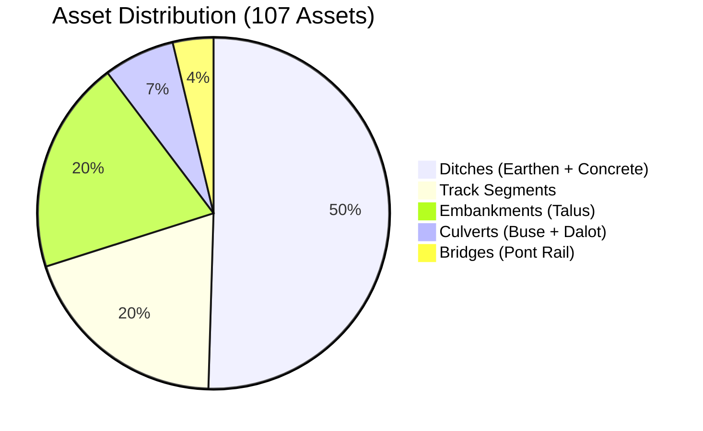

---

## Slide 5: Literature Review & DT Maturity

**Content:**
- Digital Twin maturity levels (Pedersen, 2023): Digital Model → Digital Shadow → Digital Twin.
- **This work = Digital Shadow** (unidirectional data flow, no live feedback loop yet).

**Visual — Comparison Table:**

| Reference | Domain | DT Maturity | Data Assimilation |
| :--- | :--- | :--- | :--- |
| Kaewunruen (2021) | Railway MRT | Digital Model | None |
| Kim et al. (2025) | Stormwater | Digital Twin | EKF |
| Cheetham (2016) | Railway flood | Digital Shadow | None |
| **This work** | **Railway flood** | **Digital Shadow** | **None (future)** |

---

## Slide 6: 4-Layer Funnel Architecture (KEY SLIDE)

**This is the most important architectural slide. Spend 2 minutes here.**

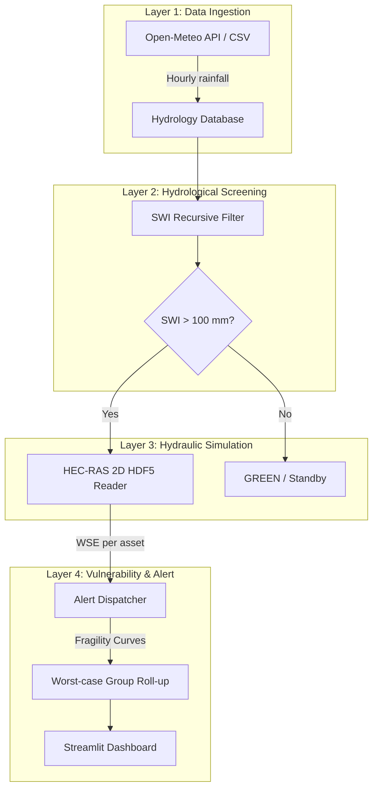

**Key Talking Point:**
> "The funnel design achieves a **>1000:1 computational savings ratio**. The SWI layer runs in sub-second time and filters out >95% of dry periods, preventing unnecessary activation of the 30-minute HEC-RAS simulation."

---

## Slide 7: Layer 2 — SWI Leaky Bucket Model

**Formulas:**
$$SWI(t) = R(t) + SWI(t-1) \times C, \quad C = 2^{-1/(T \times 24)}$$
$$C_{runoff}(SWI) = C_{min} + \frac{C_{max} - C_{min}}{1 + e^{-k(SWI - SWI_{mid})}}$$

**Parameters Table:**

| Parameter | Value | Description |
| :--- | :---: | :--- |
| Half-life $T$ | 10 days | Soil drainage rate |
| $C_{min}$ | 0.10 | Dry soil runoff |
| $C_{max}$ | 0.90 | Saturated runoff |
| $SWI_{mid}$ | 150 mm | Sigmoid midpoint |
| Trigger | 100 mm | HEC-RAS activation |

**Visual:** Include `Fig05_SWI_Storm_Response.png` showing SWI accumulation during a Cévenol event.

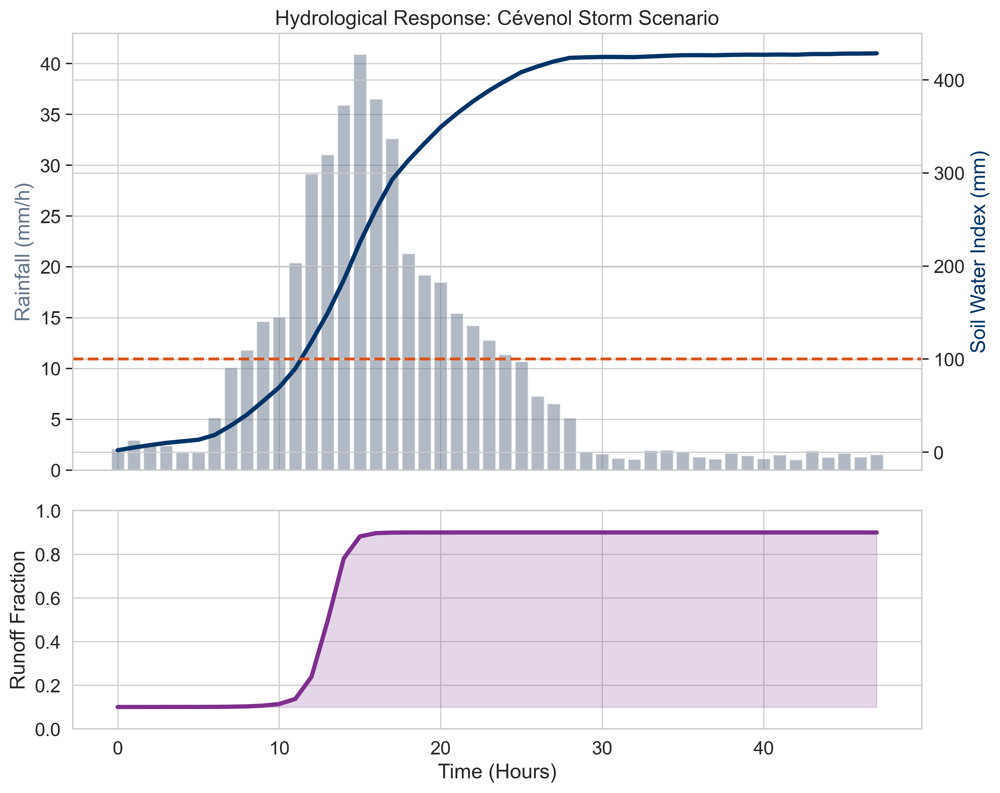

---

## Slide 8: Layer 3 — HEC-RAS 2D & HDF5 Reader

**Key Messages:**
- A live HEC-RAS 2D simulation takes **~30 minutes** for 48h at 1m resolution.
- Solution: Pre-compute plans and read results via `hecras_hdf5_reader.py`.
- **Plan 2 (21092025)**: 127 timesteps × 10-min intervals (21 hours, Sept 2025 storm).
- **Synthetic Demo Storm**: 127 timesteps with engineered peak burst.

**Visual — Data Flow:**

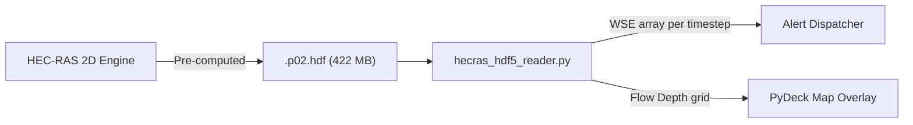

**Talking Point:**
> "The HDF5 reader extracts Water Surface Elevation (WSE) values for every cell and every timestep, enabling the timeline slider to scrub through the flood event dynamically."

---

## Slide 9: Layer 4 — Group-Based Alert Architecture (KEY SLIDE)

**Content:**
- 21 sections, each containing: Track + Talus + Drainage + Bridges.
- **Worst-case roll-up rule**: The highest severity among all sub-assets defines the section status.

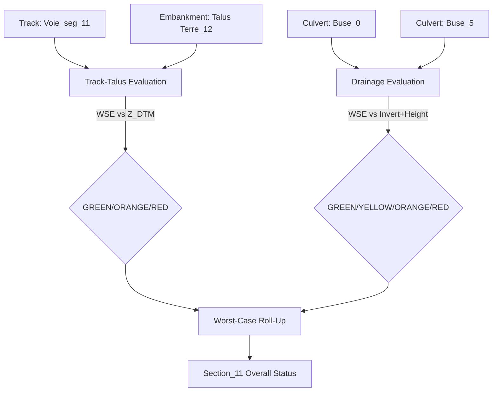

**Threshold Summary Table:**

| Asset Category | 🟡 Yellow | 🟠 Orange | 🔴 Red |
| :--- | :--- | :--- | :--- |
| **Track & Embankment** | $Z_{DTM} - 2.0\text{ m}$ (Slope toe) | $Z_{DTM} - 0.5\text{ m}$ (Ballast base) | $Z_{DTM}$ (Top of rail) |
| **Drainage (Culvert/Ditch)** | Invert bottom | Invert bottom + 50% Height | Invert bottom + Height (100% full) |
| **Bridges** | Girder bottom | Girder bottom + 0.5m freeboard | Bridge deck level (overtopped) |

---

## Slide 10: Dashboard Demo (Screenshots)

**Visual 1 — Full Dashboard Overview:**

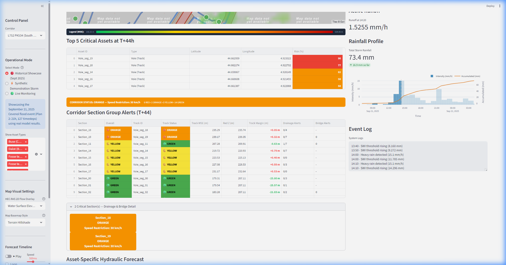

**Visual 2 — Cross-Section Analysis (Voie_seg_18):**

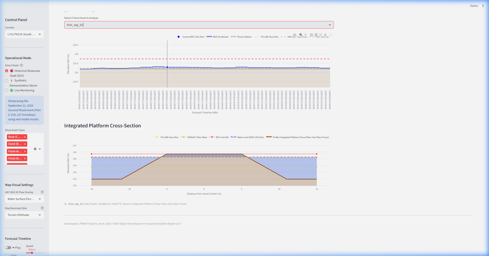

**Visual 3 — Group Alerts Table:**

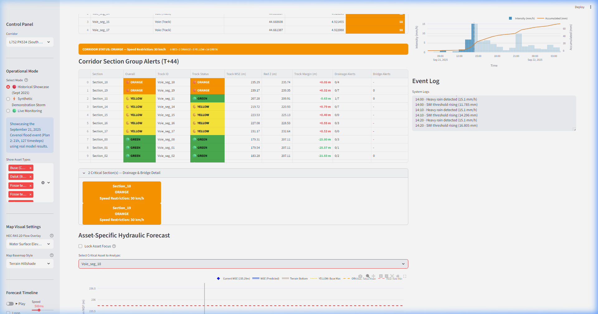

**Talking Points:**
- Point to the PyDeck map showing the flow depth overlay on the corridor.
- Show the cross-section plot with WSE breaching the orange threshold.
- Show the group alerts table with Section_11 (YELLOW from drainage) and Section_18 (ORANGE from track WSE).

---

## Slide 11: Validation — SWI Sensitivity Analysis

**Visual:** `Fig06_SWI_Sensitivity_T.png`

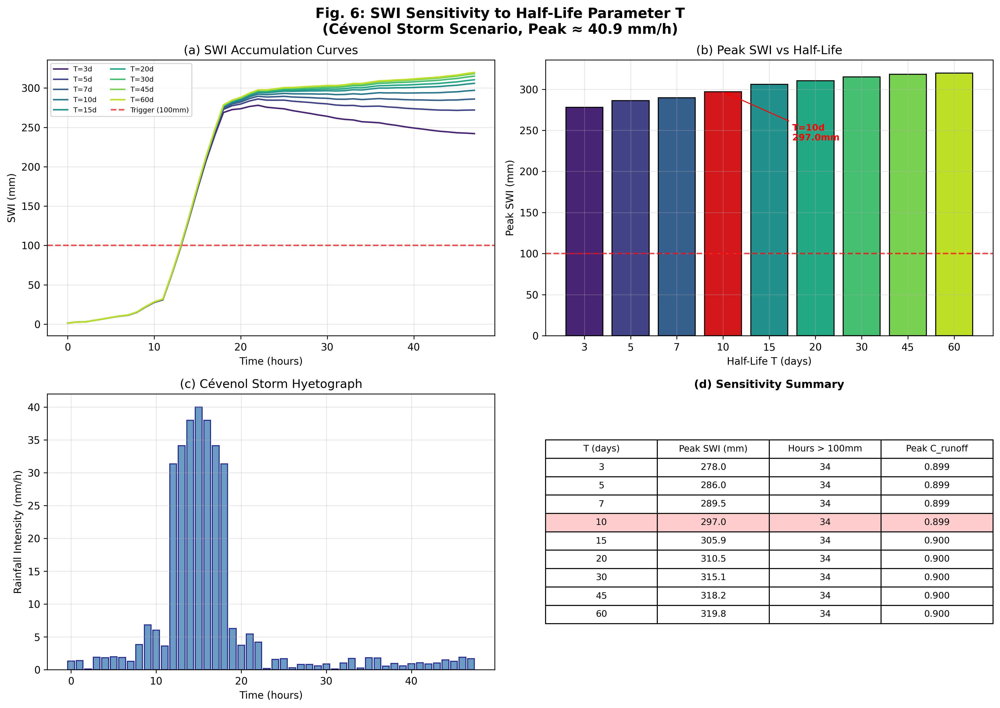

**Key Result:**
- Peak SWI varies only **15%** across $T = 3\text{–}60$ days (278–320 mm).
- **$T = 10$ days** selected: balances responsiveness with stability for clay-loam soils in the Drôme valley.
- All $T$ values produce the **same 34 hours** of HEC-RAS trigger time → robust screening.

---

## Slide 12: Validation — Fragility Curve Calibration

**Visual:** `Fig07_Fragility_Comparison.png`

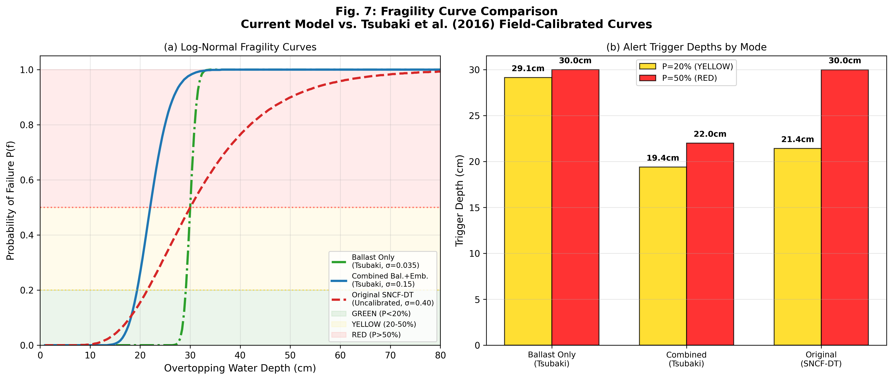

**Key Result:**
- Original uncalibrated curve ($\sigma = 0.40$) **under-estimates** failure probability at shallow depths.
- **Combined mode** (Tsubaki, 2016; $\sigma = 0.15$, $n = 31$) triggers YELLOW alerts **2 cm earlier** (at 19.4 cm vs 21.4 cm).
- This provides a critical safety margin for railway operations.

---

## Slide 13: Validation — Historical Storm Replay

**Visual:** `Fig08_Historical_Storm_Replay.png`

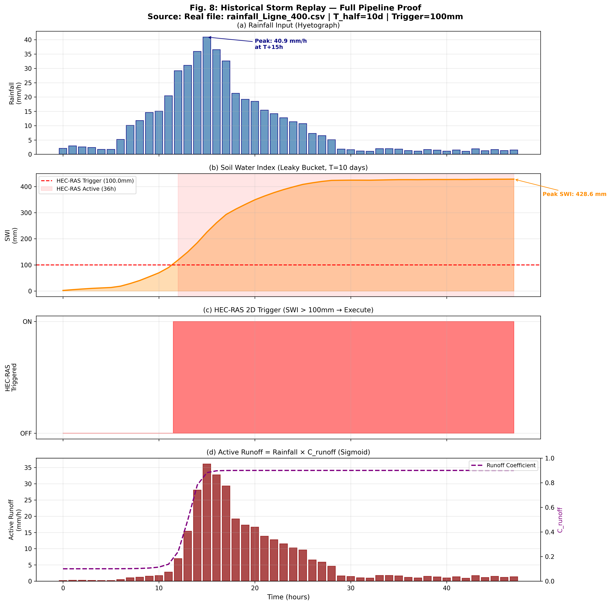

**Key Result:**
- Full pipeline replay: Rainfall → SWI → Trigger → Runoff chain.
- SWI crosses 100 mm threshold at $T+12\text{h}$, peaks at 428.6 mm.
- HEC-RAS trigger active for **36 continuous hours**.
- Runoff coefficient rises from $0.10$ (dry) to $0.90$ (saturated).

---

## Slide 14: Limitations & Roadmap

**Current Limitations:**
1. **Digital Shadow** — no bidirectional data assimilation yet.
2. **Bathtub flood extents** — not physics-based 2D polygons.
3. **Manning's $n$** — from manuals, not field-calibrated.

**Roadmap Gantt Chart:**

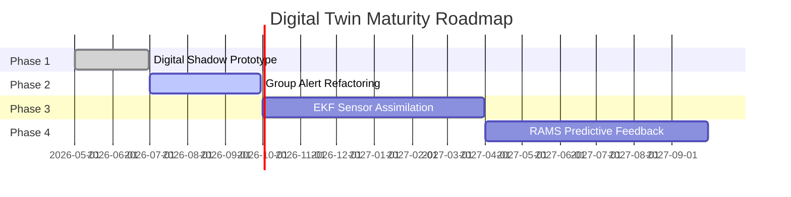

---

## Slide 15: Conclusion & Key Contributions

1. ⚡ **Funnel Strategy**: >1000:1 computational savings ratio via sub-second SWI screening.
2. 🏗️ **Section Grouping**: 107 assets → 21 sections with worst-case hazard roll-up.
3. 🔬 **Calibrated Fragility Curves**: Field-validated (Tsubaki, 2016), 2 cm earlier YELLOW alerts.
4. ✅ **End-to-End Validation**: September 2025 Cévenol storm replay confirms pipeline functionality.

**Final Statement:**
> "This prototype demonstrates a scalable, scientifically calibrated framework for predictive flood-risk management on the French rail network."

---

## Slide 16: Thank You & Q&A

**Content:**
- "Thank you for your attention."
- Author contact information
- GitHub repository link
- QR code to the live dashboard (optional)
